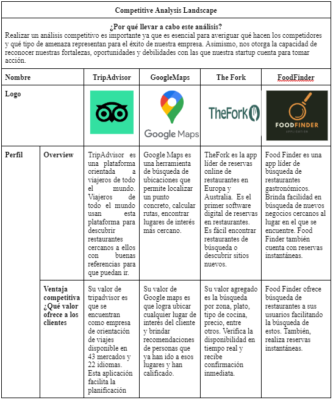
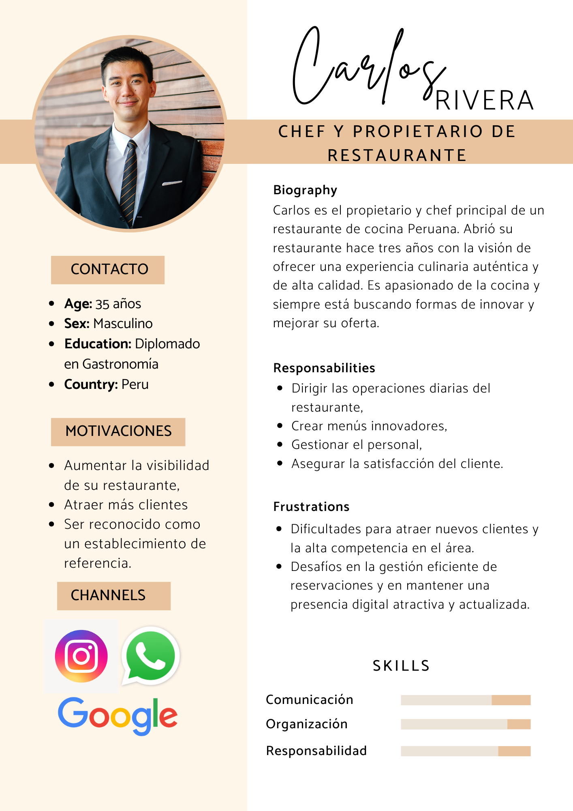

 

    <h1> Universidad Peruana de Ciencias Aplicadas </h1>

  

    Ingeniería de Software - 202401
     
    SW58 - Desarollo de Apliaciones Open Source
     
    Docente: Hugo Allan Mori Paiva
     
    Informe de Trabajo Final
     
    Startup: 
     
    Proyecto: FoodFinder
  

   <table>
        <tr> 
            <th>Alumno</th>
            <th>Codigo</th>
        </tr>
        <tr> 
            <td>Becerra Llempen, Fabiola Dayane</td>
            <td>u20171a518</td>
        </tr>
        <tr> 
            <td>Arroyo Ormeño, André Alonso</td>
            <td>U202114714</td>
        </tr>
        <tr> 
            <td>Chavez Rojas, Carlos Raul Guillermo</td>
            <td>U201910317</td>
        </tr>
        <tr> 
            <td>Vera Nuñez, Nicolas Alejandro</td>
            <td>U202214869</td>
        </tr>
    </table>

  <p"center">
    Abril-2024
  

# Registro de Versiones del Informe
|Versión|Fecha| Autor    |Descripción de modificación|
|-------|-----|----------|---------------------------|
|TB1|06/04/2024|FoodFinder|Se han incluido los  capítulos: <li> Capítulo I: Introducción<li> Capítulo II: Requirements Elicitation & Analysis<li> Capítulo III: Requirements Specification<li> Capítulo IV: Product Design<li> Capítulo V: Product Implementation, Validation & Deployment<li> Avance de Conclusiones, Bibliografía y Anexos|
|TP|02/05/2024|FoodFinder| Mejora continua: <li> User stories, As-Is Scenario Mapping, To-Be Scenario Mapping y Product Backlog.<li> Avance aplicación web y deployment con sprint 2|
|TB2|05/06/2024|FoodFinder|Mejora continua:<li> User stories<li> Sprint 3<li> Implementación de funciones adicionales en landing page, avance aplicación front-end y back-end de aplicación web|
|TF|10/04/2024|FoodFinder|Mejora continua: <li> Documentación de endpoints<li> Sprint 4<li> Implementación de funciones adicionales en landing page, vistas de aplicación front-end y back-end de aplicación web con sus respectivos despliegues.<li> Integración de los endpoints de backend con la aplicación front-end.|

# Project Report Collaboration Insights
URL del repositorio para el reporte del proyecto: https://github.com/DevFood-Finder/grupo4-project-report 

## GitHub Insights
GitHub nos permite exponer una linea de tiempo de nuestras ramas principales y el proceso al que se han sometido. Tdodas las ramas creadas fue en base al diseño de GitFlow para una buena organización y control de versiones.

Los integrantes del equipo son:

* Nicolas Vera (nicxlxs)
* Fabiola Becerra (fabidayanee)
* Carlos Chávez (CarlosChavez19)

**Student Outcomes**

|Criterio específico|Acciones realizadas|Conclusiones|
|---|---|---|
|Comunica oralmente sus ideas y/o resultados con objetividad a público de diferentes especialidades y niveles jerarquicos, en el marco del desarrollo de un proyecto eningeniería.| **Nicolas Vera** TB1: Durante el proceso de desarrollo de nuestra prototipo para nuestro futuros clientes, he terminado comprendiedno la importancia que tiene sus necesidades y deseos.Ademas, esta comprension ha mejorado gracias a distirnas charlas y reuniones que he tenido con mis compañeros de trabajo con la finalidad de poder presentar una solucion innovadora para los clientes.  TP: Durante el desarrollo de nuestro prototipo, he comprendido a fondo las necesidades de los usuarios y las características esenciales que debe tener la interfaz de nuestra aplicación. Este entendimiento ha sido enriquecido por las múltiples reuniones y discusiones con mi equipo, enfocadas en crear una solución innovadora y efectiva para nuestros usuarios.  TB2: Durante el desarrollo de nuestro prototipo, he comprendido claramente los elementos que debe incluir nuestro backend y la importancia de las relaciones entre las tablas en nuestra base de datos. Este entendimiento ha sido profundizado a través de diversas reuniones y discusiones con mi equipo, enfocadas en asegurar que nuestra solución sea robusta y eficiente para satisfacer las necesidades de los usuarios.  TF: Durante el desarrollo de nuestro prototipo, he comprendido cómo conectar eficazmente el frontend con el backend y la importancia de crear aplicaciones bien integradas. Este entendimiento se ha fortalecido mediante diversas reuniones y discusiones con mi equipo, enfocadas en desarrollar una solución cohesiva y funcional que satisfaga las necesidades de nuestros usuarios.  **Fabiola Becerra** TB1: Durante el desarrollo de nuestro prototipo he logrado comprender la importancia de las necesidades que requieren los usuarios. También, he obtenido un grado satisfactorio de comprensión al momento de reunirme con mis compañeros para poder realizar el trabajo con la finalidad de brindar una satisfacción a los usuarios.  TP: En el transcurso del desarrollo de nuestro prototipo, he llegado a entender profundamente las necesidades de los usuarios y las características fundamentales que debe tener la interfaz de nuestra aplicación. Este entendimiento se ha enriquecido gracias a numerosas reuniones y debates con mi equipo, orientados a crear una solución innovadora y efectiva para nuestros usuarios.  TB2: A lo largo del desarrollo de nuestro prototipo, he comprendido claramente los componentes que debe incluir nuestro backend y la importancia de las relaciones entre las tablas en nuestra base de datos. Este entendimiento se ha profundizado mediante diversas reuniones y discusiones con mi equipo, centradas en asegurar que nuestra solución sea robusta y eficiente para satisfacer las necesidades de los usuarios.  TF: Durante el desarrollo de nuestro prototipo, he comprendido cómo conectar eficazmente el frontend con el backend y la importancia de crear aplicaciones bien integradas. Este conocimiento se ha fortalecido mediante numerosas reuniones y discusiones con mi equipo, enfocadas en desarrollar una solución cohesiva y funcional que cumpla con las expectativas de nuestros usuarios.  **Carlos Chavez** **TB1**: Apoye con el desarrollo del capitulo 4.  **TP**: Apoye con las reuniones para el desarrollo del lading page y frontend. **TB2**:  Organice las reuniones para coordinar el desarrollo de los bounded context a presentar para esta entrega.  TF: A lo largo del desarrollo de nuestro prototipo, he llegado a entender cómo conectar de manera efectiva el frontend con el backend y la importancia de construir aplicaciones bien integradas. Este conocimiento se ha consolidado a través de múltiples reuniones y discusiones con mi equipo, centradas en desarrollar una solución cohesiva y funcional que satisfaga las expectativas de nuestros usuarios. |**Conclusión 1**:  Durante el proceso de desarrollo de nuestro prototipo para nuestros futuros clientes, he terminado comprendiendo la importancia que tiene sus necesidades y deseos.Además, esta comprensión ha mejorado gracias a distintas charlas y reuniones que he tenido con mis compañeros de trabajo con la finalidad de poder presentar una solución innovadora para los clientes.    **Conclusión 2**:  Durante el desarrollo de nuestro prototipo he logrado comprender la importancia de las necesidades que requieren los usuarios. También, he obtenido un grado satisfactorio de comprensión al momento de reunirme con mis compañeros para poder realizar el trabajo con la finalidad de brindar una satisfacción a los usuarios.  **Conclusión 3**: La comunicación oral ha sido efectiva dentro del equipo, permitiendo un intercambio fluido de ideas y una comprensión compartida de los objetivos del proyecto. Se continuará fomentando esta comunicación para mantener la colaboración y el progreso del trabajo.|
|Comunica en forma escrita ideas y/o resultados con objetividad a público de diferentes especialidades y niveles jerarquicos, en el marco del desarrollo de un proyecto en ingeniería.| **Nicolas Vera** TB1: Gracias al correcto trabajo en equipo que hemos realizado nos ha permitido crear un prototipo que supera las expectativas de nuestros clientes; ya que ofrecemos soluciones innovadoras que resuelven problemas que son evidenciados en la actualidad.  TP: Mediante el trabajo en equipo, hemos logrado crear un prototipo asertivo en el desarrollo del frontend, superando las expectativas de nuestros clientes. Nuestro prototipo ofrece soluciones de manera eficaz e innovadora para los usuarios, reflejando nuestro compromiso con la calidad y la funcionalidad.Ademas, realice el login, el register y ayude a realizar el menu principal  TB2: Mediante el trabajo en equipo, hemos logrado crear un prototipo asertivo en el desarrollo del backend, superando las expectativas de nuestros clientes. Nuestro prototipo ofrece soluciones de manera eficaz e innovadora para los usuarios, asegurando un rendimiento robusto y confiable del sistema. Ademas, ayude a realizar algunas tablas y en el apartado del login del backend  TF: Mediante el trabajo en equipo, hemos logrado crear un prototipo asertivo que integra perfectamente el frontend con el backend, superando las expectativas de nuestros clientes. Nuestro prototipo ofrece soluciones de manera eficaz e innovadora para los usuarios, destacando la importancia de una aplicación bien conectada y funcional en todos sus aspectos.Ademas, termine el bounded context review  **Fabiola Becerra** TB1: Mediante la realización del trabajo en equipo hemos logrado crear un prototipo de manera asertiva en el aspecto de superar las expectativas de nuestros clientes, ya que nuestro prototipo ofrece soluciones de una manera eficaz e innovadora para los usuarios.  TP: Gracias al trabajo colaborativo, hemos desarrollado un prototipo sólido en el ámbito del frontend, superando las expectativas de nuestros clientes. Nuestro prototipo proporciona soluciones de manera eficiente e innovadora para los usuarios, demostrando nuestro compromiso con la excelencia y la funcionalidad.  TB2: A través del esfuerzo conjunto, hemos creado un prototipo robusto en el desarrollo del backend, excediendo las expectativas de nuestros clientes. Nuestro prototipo ofrece soluciones de manera eficiente e innovadora para los usuarios, garantizando un rendimiento sólido y fiable del sistema.  TF: Mediante la colaboración efectiva, hemos desarrollado un prototipo cohesivo que integra de manera óptima el frontend con el backend, superando las expectativas de nuestros clientes. Nuestro prototipo ofrece soluciones de manera eficiente e innovadora para los usuarios, subrayando la importancia de una aplicación bien conectada y operativa en todos sus aspectos.   **Carlos Chavez** **TB1**:  Apoye con la realizacion del punto 4.1 al 4.5 y desarollo del lading page **TP**: Desarrolle el bounded context "profiles" para el backend del proyecto.  **TF**: Gracias a la colaboración efectiva, hemos creado un prototipo cohesivo que integra de manera óptima el frontend con el backend, superando las expectativas de nuestros clientes. Nuestro prototipo proporciona soluciones de manera eficiente e innovadora para los usuarios, destacando la importancia de una aplicación bien conectada y funcional en todos sus aspectos.|**Conclusión 1**: Gracias al correcto trabajo en equipo que hemos realizado nos ha permitido crear un prototipo que supera las expectativas de nuestros clientes; ya que ofrecemos soluciones innovadoras que resuelven problemas que son evidenciados en la actualidad.  **Conclusión 2**: Mediante la realización del trabajo en equipo hemos logrado crear un prototipo de manera asertiva en el aspecto de superar las expectativas de nuestros clientes, ya que nuestro prototipo ofrece soluciones de una manera eficaz e innovadora para los usuarios.  **Conclusión 3**: La comunicación escrita ha sido crucial para documentar el progreso del proyecto y asegurar la comprensión de los entregables entre los miembros del equipo. Se seguirá manteniendo un enfoque claro y conciso en la comunicación escrita para garantizar la eficacia y la calidad del trabajo.
|

- [Contenido](#contenido)

- [**Capítulo I: Introducción.**](#capítulo-i-introducción)
    - [**1.1  Startup Profile.**](#11-startup-profile)
        - [**1.1.1. Descripción del startup.**](#111-descripcion-del-startup)
        - [**1.1.2.  Perfiles de los integrantes del equipo.**](#112-perfiles-de-los-integrantes-del-equipo)
    - [**1.2. Solution Profile.**](#12-solution-profile)
        - [**1.2.1. Antecedentes y Problemática.**](#121-antecedentes-y-problemática)
        - [**1.2.2. Lean UX Process.**](#122-lean-ux-process)
            - [**1.2.2.1. Lean UX Problem Statements.**](#1221-lean-ux-problem-statements)
            - [**1.2.2.2. Lean UX Assumptions.**](#1222-lean-ux-assumptions)
            - [**1.2.2.3. Lean UX Hypothesis Statements.**](#1223-lean-ux-hypothesis-statements)
            - [**1.2.2.4. Lean UX Canvas.**](#1224-lean-ux-canvas)
    - [**1.3. Segmentos objetivo.**](#13-segmentos-objetivo)
- [**Capítulo II: Requirements Elicitation \& Analysis**](#capítulo-ii-requirements-elicitation--analysis)
    - [**2.1. Competidores.**](#21-competidores)
        - [**2.1.1. Análisis competitivo.**](#211-análisis-competitivo)
        - [**2.1.2. Estrategias y tácticas frente a competidores.**](#212-estrategias-y-tácticas-frente-a-competidores)
    - [**2.2. Entrevistas.**](#22-entrevistas)
        - [**2.2.1. Diseño de entrevistas.**](#221-diseño-de-entrevistas)
        - [**2.2.2. Registro de entrevistas.**](#222-registro-de-entrevistas)
        - [**2.2.3. Análisis de entrevistas.**](#223-análisis-de-entrevistas)
    - [**2.3. Needfinding.**](#23-needfinding)
        - [**2.3.1. User Personas.**](#231-user-personas)
        - [**2.3.2. User Task Matrix.**](#232-user-task-matrix)
        - [**2.3.3. User Journey Mapping**](#233-user-journey-mapping)
        - [**2.3.4. Empathy Mapping**](#234-empathy-mapping)
        - [**2.3.5. As-is Scenario Mapping**](#235-as-is-scenario-mapping)
- [**Capítulo III: Requirements Specification.**](#capítulo-iii-requirements-specification)
    - [**3.1. To-Be Scenario Mapping.**](#31-to-be-scenario-mapping)
    - [**3.2.User Stories.**](#32user-stories)
    - [**3.3. Impact Mapping.**](#33-impact-mapping)
    - [**3.4. Product Backlog.**](#34-product-backlog)
- [**Capítulo IV: Product Design.**](#capítulo-iv-product-design)
    - [**4.1. Style Guidelines.**](#41-style-guidelines)
        - [**4.1.1. General Style Guidelines.**](#411-general-style-guidelines)
        - [**4.1.2. Web Style Guidelines.**](#412-web-style-guidelines)
    - [**4.2. Information Architecture.**](#42-information-architecture)
        - [**4.2.1. Organization Systems.**](#421-organization-systems)
        - [**4.2.2. Labeling Systems.**](#422-labeling-systems)
        - [**4.2.3. SEO Tags and Meta Tags.**](#423-seo-tags-and-meta-tags)
        - [**4.2.4. Searching Systems.**](#424-searching-systems)
        - [**4.2.5. Navigation Systems.**](#425-navigation-systems)
    - [**4.3. Landing Page UI Design**](#43-landing-page-ui-design)
        - [**4.3.1. Landing Page Wireframe.**](#431-landing-page-wireframe)
        - [**4.3.2. Landing Page Mock-up.**](#432-landing-page-mock-up)
    - [**4.4. Web Applications UX/UI Design.**](#44-web-applications-uxui-design)
        - [**4.4.1. Web Applications Wireframes.**](#441-web-applications-wireframes)
        - [**4.4.2. Web Applications Wireflow Diagrams.**](#442-web-applications-wireflow-diagrams)
        - [**4.4.3. Web Applications Mock-ups.**](#443-web-applications-mock-ups)
        - [**4.4.4. Web Applications User Flow Diagrams.**](#444-web-applications-user-flow-diagrams)
    - [**4.5. Web Applications Prototyping.**](#45-web-applications-prototyping)
    - [**4.6. Domain-Driven Software Architecture**](#46-domain-driven-software-architecture)
        - [**4.6.1. Software Architecture Context Diagram.**](#461-software-architecture-context-diagram)
        - [**4.6.2. Software Architecture Container Diagrams.**](#462-software-architecture-container-diagrams)
        - [**4.6.3. Software Architecture Components Diagrams.**](#463-software-architecture-components-diagrams)
    - [**4.7. Software Object-Oriented Design.**](#47-software-object-oriented-design)
        - [**4.7.1. Class Diagrams.**](#471-class-diagrams)
        - [**4.7.2. Class Dictionary.**](#472-class-dictionary)
    - [**4.8. Database Design.**](#48-database-design)
        - [**4.8.1. Database Diagram.**](#481-database-diagram)
- [**Capítulo V: Product Implementation, Validation \& Deployment.**](#capítulo-v-product-implementation-validation--deployment)
    - [**5.1. Software Configuration Management.**](#51-software-configuration-management)
        - [**5.1.1. Software Development Environment Configuration.**](#511-software-development-environment-configuration)
        - [**5.1.2. Source Code Management.**](#512-source-code-management)
        - [**5.1.3. Source Code Style Guide \& Conventions.**](#513-source-code-style-guide--conventions)
        - [**5.1.4. Software Deployment Configuration.**](#514-software-deployment-configuration)
    - [**5.2. Landing Page, Services \& Applications Implementation.**](#52-landing-page-services--applications-implementation)
        - [**5.2.1. Sprint 1.**](#521-sprint-1)
            - [**5.2.1.1. Sprint Planning 1.**](#5211-sprint-planning-1)
            - [**5.2.1.2. Sprint Backlog 1.**](#5212-sprint-backlog-1)
            - [**5.2.1.3. Development Evidence for Sprint Review.**](#5213-development-evidence-for-sprint-review)
            - [**5.2.1.4. Testing Suite Evidence for Sprint Review.**](#5214-testing-suite-evidence-for-sprint-review)
            - [**5.2.1.5. Execution Evidence for Sprint Review.**](#5215-execution-evidence-for-sprint-review)
            - [**5.2.1.6. Services Documentation Evidence for Sprint Review.**](#5216-services-documentation-evidence-for-sprint-review)
            - [**5.2.1.7. Software Deployment Evidence for Sprint Review.**](#5217-software-deployment-evidence-for-sprint-review)
            - [**5.2.1.8. Team Collaboration Insights during Sprint.**](#5218-team-collaboration-insights-during-sprint)
        - [**5.2.2. Sprint 2.**](#522-sprint-2)
            - [**5.2.2.1. Sprint Planning 2.**](#5221-sprint-planning-2)
            - [**5.2.2.2. Sprint Backlog 2.**](#5222-sprint-backlog-2)
            - [**5.2.2.3. Development Evidence for Sprint Review.**](#5223-development-evidence-for-sprint-review)
            - [**5.2.2.4. Testing Suite Evidence for Sprint Review.**](#5224-testing-suite-evidence-for-sprint-review)
            - [**5.2.2.5. Execution Evidence for Sprint Review.**](#5225-execution-evidence-for-sprint-review)
            - [**5.2.2.6. Services Documentation Evidence for Sprint Review.**](#5226-services-documentation-evidence-for-sprint-review)
            - [**5.2.2.7. Software Deployment Evidence for Sprint Review.**](#5227-software-deployment-evidence-for-sprint-review)
            - [**5.2.2.8. Team Collaboration Insights during Sprint.**](#5228-team-collaboration-insights-during-sprint)
        - [**5.2.3. Sprint 3.**](#523-sprint-3)
            - [**5.2.3.1. Sprint Planning 3.**](#5231-sprint-planning-3)
            - [**5.2.3.2. Sprint Backlog 3.**](#5232-sprint-backlog-3)
            - [**5.2.3.3. Development Evidence for Sprint Review.**](#5233-development-evidence-for-sprint-review)
            - [**5.2.3.4. Testing Suite Evidence for Sprint Review.**](#5234-testing-suite-evidence-for-sprint-review)
            - [**5.2.3.5. Execution Evidence for Sprint Review.**](#5235-execution-evidence-for-sprint-review)
            - [**5.2.3.6. Services Documentation Evidence for Sprint Review.**](#5236-services-documentation-evidence-for-sprint-review)
            - [**5.2.3.7. Software Deployment Evidence for Sprint Review.**](#5237-software-deployment-evidence-for-sprint-review)
            - [**5.2.3.8. Team Collaboration Insights during Sprint.**](#5238-team-collaboration-insights-during-sprint)
        - [**5.2.4. Sprint 4.**](#524-sprint-4)
            - [**5.2.4.1. Sprint Planning 4.**](#5241-sprint-planning-4)
            - [**5.2.4.2. Sprint Backlog 4.**](#5242-sprint-backlog-4)
            - [**5.2.4.3. Development Evidence for Sprint Review.**](#5243-development-evidence-for-sprint-review)
            - [**5.2.4.4. Testing Suite Evidence for Sprint Review.**](#5244-testing-suite-evidence-for-sprint-review)
            - [**5.2.4.5. Execution Evidence for Sprint Review.**](#5245-execution-evidence-for-sprint-review)
            - [**5.2.4.6. Services Documentation Evidence for Sprint Review.**](#5246-services-documentation-evidence-for-sprint-review)
            - [**5.2.4.7. Software Deployment Evidence for Sprint Review.**](#5247-software-deployment-evidence-for-sprint-review)
            - [**5.2.4.8. Team Collaboration Insights during Sprint.**](#5218-team-collaboration-insights-during-sprint)
- [**Capítulo VI: Conclusion.**](#capítulo-vi-conclusion)
- [**Capítulo VII: Bibliografia.**](#capítulo-vii-bibliografia)
- [8. **Anexos.**](#anexos)

# [Capítulo I: Introducción.](#capítulo-i-introducción)
## [1.1 Startup Profile](#startup-profile)
### [1.1.1 Descripción del Startup](#descripcion-del-startup)
Food Finder es una empresa que surge a partir de la necesidad de crear un software versátil, íntegro, adaptable y de calidad para la industria de la gastronomía. La misión de nuestra startup es conectar a las personas con experiencias gastronómicas excepcionales al proporcionar una plataforma intuitiva y conveniente para descubrir, explorar y reservar en restaurantes cercanos, fomentando así la exploración culinaria, la cultura y la conexión con la comunidad local.

Misión:
Nuestra misión es enriquecer la vida de las personas al conectarlas con experiencias gastronómicas excepcionales. A través de nuestra plataforma intuitiva y conveniente, facilitamos el descubrimiento, la exploración y la reserva en restaurantes cercanos, fomentando la exploración culinaria y fortaleciendo la conexión con la cultura y la comunidad local.

Visión:
Aspiramos a ser el líder global en soluciones de descubrimiento culinario, transformando la manera en que las personas experimentan la comida y la cultura gastronómica. Nuestro objetivo es crear una comunidad donde cada exploración culinaria enriquezca el conocimiento, el paladar y el vínculo con las culturas a nivel mundial, promoviendo un intercambio cultural vibrante y una comprensión más profunda a través de la gastronomía.

**Logo del servicio**:

### [1.1.2 Perfiles de los integrantes del equipo](#perfiles-de-los-integrantes-del-equipo)
|Miembros del equipo | Codigo Estudiante | Carrera | Conocimientos / Habilidades |
|-|-|-|-|
|Vera Nuñez, Nicolas Alejandro |U202114545 |Ingenieria de software|Tengo 19 años y estudio la carrera de Ingeniería de Software en la Universidad Peruana de Ciencias Aplicadas (UPC). Me apasiona la tecnología y la capacidad que tiene para resolver problemas de la vida cotidiana. Soy una persona eficiente, comprometida, creativa y apasionada por el desarrollo de software. Además, cuento con habilidades básicas en python y javascript.  Tengo un fuerte interés en adquirir nuevos conocimientos y aplicarlos en distintos proyectos que tienen la finalidad de buscar la innovación.|
|Chávez Rojas, Carlos Raúl Guillermo |U201910317|Ingenieria de software|Tengo 22 años y estudió la carrera de Ingeniería de Software en la Universidad Peruana de Ciencias Aplicadas (UPC). Me apasiona el mundo digital y la capacidad de la tecnología para solucionar problemas y crear nuevas experiencias. Soy una persona proactiva, responsable y con gran capacidad de aprendizaje. Tengo un fuerte interés por la investigación y la innovación, y estoy siempre buscando nuevas formas de mejorar mis habilidades y conocimientos.|
|Becerra Llempen, Fabiola Dayane |U20171a518|Ingenieria de software|Soy Fabiola Becerra, actualmente estudio la carrera de Ingeniería de Software en la Universidad Peruana de Ciencias Aplicadas (UPC). Soy una apasionada de la tecnología e innovación, utilizando todas las herramientas de software disponibles. Me considero una persona dinámica, responsable y con muchas ganas de enfrentar nuevos retos y experiencias. Mis temas de interés son la inteligencia artificial y la innovación en estos campos. Siempre estoy al tanto de los temas actuales para reforzar mis conocimientos y mejorar mis habilidades blandas. Por último, me siento capacitada para colaborar en equipo y asimilar con rapidez nuevos aprendizajes.|

## [1.2 Solution Profile](#solution-profile)
### [1.2.1 Antecedentes y Problemática](#antecedentes-y-problemática)

En muchas ocasiones, las personas enfrentan el dilema de elegir un restaurante para disfrutar de una comida satisfactoria. Todo esto se debe a la amplia oferta gastronómica disponible, la falta de información sobre las opciones disponibles, la calidad de la comida y la experiencia general en cada establecimiento. Esta falta de información conduce a una menor afluencia de público hacia los restaurantes, lo que a su vez resulta en un bajo consumo en estos establecimientos. Además, según Blanca Chávez, presidenta del Comité de Restaurantes de la Asociación Peruana de Hoteles, Restaurantes y Afines, señala que las ventas se han reducido hasta en un 40% en los locales gastronómicos debido a esto.

Esta problemática afecta tanto a los consumidores, que se sienten abrumados por la cantidad de opciones y la falta de información, como a los restaurantes, que ven reducida su clientela y, por lo tanto, sus ingresos. Además, la falta de transparencia en la información sobre los restaurantes dificulta la competencia justa en el mercado gastronómico. Por ello, este escenario destaca la necesidad de una solución.

|**What (Qué)**|La amplia oferta gastronómica disponible y la falta de información sobre las opciones disponibles, la calidad de la comida y la experiencia general en cada establecimiento, generan un dilema al momento de elegir un restaurante para disfrutar de una comida satisfactoria.|
| :-: | :- |
|**When (Cuándo)**|Esta situación se presenta de manera constante, ya que la falta de información sobre restaurantes es un problema continuo para muchas personas.|
|**Where (Dónde)**|Esta problemática puede observarse en diversas ciudades y regiones con una alta concentración de restaurantes y una fuerte competencia en el sector gastronómico.|
|**Who (Quién)**|El problema involucra a los consumidores que buscan lugares para comer y a los restaurantes que buscan atraer más clientes.|
|**Why (Por qué)**|
Existen diversas razones para los consumidores y los restaurantes:

- La amplia oferta gastronómica disponible

- La falta de información sobre las opciones disponibles

- La experiencia general en cada establecimiento

- La poca publicidad de los restaurantes

|
|**How (Cómo)**|La falta de información detallada sobre los restaurantes dificulta a los consumidores tomar decisiones informadas sobre dónde comer, lo que resulta en una menor afluencia de público hacia estos establecimientos y un bajo consumo en ellos.|
|**How much (Cuánto)**|Según las estadísticas de la INEI, la actividad de restaurantes (servicios de comidas y bebidas) se contrajo en 1,90% en el décimo mes del año 2023, con reportes en baja de tres de sus cuatro componentes. Ademas, el grupo de restaurantes mostró una variación de -5,66%, por menor actividad en los negocios de pollerías, carnes y parrillas, restaurantes, comidas rápidas, cevicherías, restaurantes turísticos, heladerías y chifas. El principal motivo es la menor afluencia de comensales y el incremento de precios a la carta.|

### [1.2.2 Lean UX Process](#lean-ux-process)
#### [1.2.2.1 Lean UX Problem Statements](#lean-ux-problem-statements)

**Problem Statement 1**

**Problema:** Los usuarios encuentran difícil descubrir nuevos restaurantes que se ajusten a sus gustos y preferencias debido a la falta de recomendaciones personalizadas y a la sobrecarga de opciones en el mercado.

**Impacto:** Los usuarios pueden sentirse abrumados y frustrados al intentar encontrar un restaurante adecuado, lo que resulta en decisiones poco informadas o en la elección de opciones seguras y conocidas en lugar de experiencias nuevas y emocionantes.

**Causas:** Falta de un algoritmo de recomendación personalizada que tenga en cuenta las preferencias y comportamientos pasados de los usuarios, y la falta de diferenciación de la plataforma en un mercado saturado de aplicaciones de búsqueda de restaurantes.

**Problem Statement 2**

**Problema:** Los restaurantes locales luchan por aumentar su visibilidad y atraer a más clientes, especialmente durante los períodos de baja demanda, debido a la falta de herramientas efectivas de marketing digital a bajo costo.

**Impacto:** Los restaurantes pueden experimentar una disminución en las reservas y en los ingresos durante los períodos de baja demanda, lo que puede afectar su viabilidad económica a largo plazo. 

**Causas:** Falta de una plataforma que les permita promocionar ofertas especiales y eventos exclusivos para atraer a nuevos clientes y fidelizar a los existentes, y la falta de colaboraciones estratégicas que les permitan destacar en un mercado competitivo.

#### [1.2.2.2 Lean UX Assumptions](#lean-ux-assumptions)

**Business Assumptions**

- **Creo que mis usuarios necesitan** una forma sencilla y rápida de encontrar restaurantes cercanos que se ajusten a sus preferencias culinarias, con la opción de explorar menús y hacer reservas directamente desde una sola plataforma.

- **Estas necesidades se pueden resolver** mediante una plataforma web y móvil intuitiva que use tecnología de geolocalización para sugerir restaurantes, proporcionando información detallada, reseñas de usuarios, menús completos y la opción de reserva en línea para los usuarios premium.

- **Mis clientes iniciales** serán jóvenes profesionales y familias que viven en áreas urbanas densamente pobladas, quienes valoran la conveniencia y buscan explorar diversas opciones culinarias cerca de ellos.

- **-El valor #1 que el cliente requiere de mi servicio** es la capacidad de descubrir rápidamente restaurantes que se ajusten a sus necesidades específicas y gustos, con la facilidad de reservar una mesa sin necesidad de cambiar de aplicación o realizar llamadas telefónicas.

- **El cliente también puede obtener estos servicios adicionales** como recomendaciones personalizadas basadas en su historial de búsqueda y preferencias, ofertas exclusivas para miembros premium, y la posibilidad de acumular puntos o recompensas por cada reserva realizada.

- **Voy a adquirir a mis clientes a través de** campañas de marketing digital enfocadas en redes sociales, colaboraciones con influencers locales en el ámbito gastronómico, SEO local para asegurar una alta visibilidad en búsquedas relacionadas con restaurantes, y alianzas estratégicas con restaurantes para ofrecer promociones exclusivas.

- **Mi competencia en el mercado** incluye otras aplicaciones y sitios web de reseñas de restaurantes, así como plataformas de reserva en línea. Sin embargo, muchas de estas plataformas no ofrecen una experiencia de usuario integrada que combine descubrimiento, reseñas auténticas y reserva en una sola interfaz.

- **Los venceremos debido** a nuestro enfoque en la personalización y la experiencia del usuario, ofreciendo no solo un servicio de búsqueda y reserva, sino también creando una comunidad en torno a la exploración culinaria, con contenido exclusivo y ventajas significativas para nuestros usuarios premium.

- **Mis mayores riesgos de producto** son no lograr una masa crítica de usuarios y restaurantes participantes rápidamente, y la posibilidad de que los usuarios encuentren suficiente valor en la versión gratuita y no opten por el plan premium.

- **Resolveremos esto** enfocándonos en construir una sólida base inicial de usuarios y restaurantes a través de ofertas y promociones exclusivas, y asegurando que el valor proporcionado por la suscripción premium exceda significativamente el costo, por ejemplo, ofreciendo descuentos exclusivos, eventos especiales y acceso prioritario a reservas en restaurantes de alta demanda.

**User Assumptions**

**¿Quién es el usuario?** 

- Personas interesadas en descubrir nuevos restaurantes
- Restaurantes que quieren darse a conocer.
 

**¿Dónde encaja nuestro servicio en su trabajo o vida?** 

En cuanto a las personas interesadas en descubrir nuevos restaurantes (comensales), nuestro servicio se convierte en una herramienta esencial para la planificación de comidas, encuentros sociales y exploración culinaria. Además, facilita la decisión de dónde comer basándose en preferencias personales, ubicación y recomendaciones.

En cuanto a los restaurantes, nuestra solución se integra en su estrategia de marketing y operaciones diarias como una plataforma para atraer nuevos clientes y gestionar reservas, mejorando así su visibilidad y rentabilidad.

**¿Qué problema tiene nuestro servicio y cómo se resuelve?**

- Un problema es la dificultad para conectar restaurantes locales con clientes potenciales interesados en nuevas experiencias gastronómicas. Nuestra solución a este problema es implementar un algoritmo de recomendación personalizada que sugiera restaurantes basados en las preferencias gastronómicas y comportamientos de reserva de los usuarios. Además, le permitiremos a los restaurantes publicar ofertas exclusivas y organizar eventos gastronómicos exclusivos en colaboración con nuestra plataforma. De igual forma, implementaremos un programa de recompensas para incentivar la fidelidad de los usuarios y aumentar las reservas a través de la plataforma. Estas recompensas serán algunas promociones en ciertos restaurantes

- Otro problema es la insuficiente diferenciación de la plataforma en un mercado saturado de aplicaciones de búsqueda de restaurantes. Nuestra solución a este problema es enfocarnos en la experiencia del usuario, diseñaremos una interfaz intuitiva y atractiva centrada en la facilidad de uso y la personalización. Además, fomentaremos el contenido generado por usuarios reales para aumentar la confianza y autenticidad de la plataforma. Asimismo, nos asociaremos con influencers gastronómicos locales y ofreceremos servicios adicionales, como la reserva de experiencias culinarias únicas, para diferenciarnos de la competencia.

**¿Cuándo y cómo es usado nuestro servicio?**

- Los usuarios utilizan el servicio a través de nuestra plataforma intuitiva para buscar y reservar restaurantes en cualquier momento, ya sea para planificar con antelación o para encontrar opciones de última hora.
- Los restaurantes acceden a nuestro servicio para actualizar su perfil, menús, y disponibilidad de reserva, así como para revisar y gestionar las reservas entrantes y feedback de los clientes a diario.

**Users outcomes**

- Descubrimiento de nuevas experiencias gastronómicas.
- Menor tiempo y esfuerzo para planificar comidas y reservas.
- Satisfacción por vivir experiencias culinarias que cumplen o superan las expectativas.

**Business outcomes**

- Aumento en el número de usuarios y reservas realizadas a través de la plataforma.
- Crecimiento en la adquisición de usuarios premium.
- Mayor número de restaurantes registrados y activos en la plataforma.

**Features**

**¿Qué características son importantes?** 

- Búsqueda y filtrado avanzados por tipo de cocina, ubicación, rango de precio, y valoraciones.
- Reservas en línea y gestión de reservas para usuarios y restaurantes.
- Perfiles de restaurantes con menús, fotos y reseñas de usuarios.
- Sistema de recomendaciones personalizadas.
- Programa de recompensas y beneficios para usuarios premium.

**¿Cómo debería verse y comportarse nuestro servicio?**

- Interfaz de usuario intuitiva y amigable para todos los grupos de edad.
- Respuesta rápida y rendimiento óptimo en todas las plataformas (web y móvil).
- Diseño atractivo que invite a la exploración y descubrimiento.
- Proceso de reserva simplificado, con mínimos pasos para finalizar una reserva.
- Comunicación clara y transparente de los beneficios de la suscripción premium.

#### [1.2.2.3 Lean UX Hypothesis Statements](#lean-ux-hypothesis-statements)

1. Creemos que ofrecer a los usuarios la capacidad de ver menús completos y hacer reservas directamente a través de nuestra plataforma para aquellos interesados en descubrir nuevos restaurantes conseguirá aumentar la satisfacción del usuario y el número de reservas. Lo sabremos cuando veamos un aumento del 20% en las reservas realizadas y una mejora en las calificaciones y comentarios en nuestra plataforma.

1. Creemos que implementar un sistema de recomendaciones personalizadas basado en preferencias culinarias previas y valoraciones para nuestros usuarios conseguirá aumentar la retención de usuarios en un 30%. Lo sabremos cuando veamos un aumento en la frecuencia de uso de la plataforma y en el número de sesiones por usuario.

1. Creemos que al ofrecer a los restaurantes una herramienta para gestionar reservas y promocionar ofertas especiales a un público objetivo interesado en nuevas experiencias gastronómicas, conseguiremos aumentar en un 25% el número de restaurantes que se registran en nuestra plataforma. Lo sabremos cuando veamos un aumento en el número de registros de restaurantes y en la publicación de ofertas especiales.
1. Creemos que al mejorar la interfaz de usuario de nuestra aplicación móvil para hacerla más intuitiva y amigable para personas de todas las edades, conseguiremos un aumento del 15% en la adquisición de nuevos usuarios. Lo sabremos cuando veamos un aumento en las descargas de la aplicación y en la actividad de nuevos usuarios durante el primer mes después del lanzamiento de la versión mejorada.

1. Creemos que ofreciendo a los usuarios premium la posibilidad de acceder a eventos culinarios exclusivos y ofertas especiales de restaurantes aumentaremos la conversión de usuarios estándar a premium en un 10%. Lo sabremos cuando veamos un aumento en la suscripción premium y una participación activa en eventos y ofertas registradas.

#### [1.2.2.4 Lean UX Canvas](#1224-lean-ux-canvas)

<table><tr><th valign="top">
<b>1. Problema del negocio</b>

- Dificultad para conectar restaurantes locales con clientes potenciales interesados en nuevas experiencias gastronómicas.

- Insuficiente diferenciación de la plataforma en un mercado saturado de aplicaciones de búsqueda de restaurantes.

&emsp;
</th><th rowspan="2" valign="top">
<b>5. Soluciones</b>

- Implementar un algoritmo de recomendación personalizado basado en las preferencias gastronómicas y comportamientos de reserva de los usuarios.

- Implementar un programa de recompensas.

- Permitir a los restaurantes publicar ofertas exclusivas y organizar eventos gastronómicos exclusivos en la plataforma.

- Asociaremos con influencers gastronómicos locales y ofreceremos servicios adicionales

- Enfocarnos en la experiencia del usuario, diseñaremos una interfaz intuitiva y atractiva centrada en la facilidad de uso y la personalización.
</th><th valign="top">
<b>2. Resultados del negocio</b>

- Aumento en el número de usuarios y reservas realizadas a través de la plataforma.

- Crecimiento en la adquisición de usuarios premium.

- Mayor número de restaurantes registrados y activos en la plataforma.
</th></tr>
<tr><td valign="top">
<b>3. Usuarios y Clientes</b>

- Personas interesadas en descubrir nuevos restaurantes

- Restaurantes que quieren darse a conocerse 
</td><td valign="top">
<b>4. Resultados del usuario</b>

- Descubrimiento de nuevas experiencias gastronómicas.

- Menor tiempo y esfuerzo para planificar comidas y reservas.

- Satisfacción por vivir experiencias culinarias que cumplen o superan las expectativas.

&emsp;
</td></tr>
<tr><td valign="top">
<b>6. Hipótesis</b>

- Creemos que ofrecer a los usuarios la capacidad de ver menús completos y hacer reservas directamente a través de nuestra plataforma para aquellos interesados en descubrir nuevos restaurantes conseguirá aumentar la satisfacción del usuario y el número de reservas. 

&emsp;

- Creemos que implementar un sistema de recomendaciones personalizadas basado en preferencias culinarias previas y valoraciones para nuestros usuarios conseguirá aumentar la retención de usuarios en un 30%.

&emsp;

- Creemos que al ofrecer a los restaurantes una herramienta para gestionar reservas y promocionar ofertas especiales a un público objetivo interesado en nuevas experiencias gastronómicas, conseguiremos aumentar en un 25% el número de restaurantes que se registran en nuestra plataforma. 

&emsp;

- Creemos que al mejorar la interfaz de usuario de nuestra aplicación móvil para hacerla más intuitiva y amigable para personas de todas las edades, conseguiremos un aumento del 15% en la adquisición de nuevos usuarios.

&emsp;

- Creemos que ofreciendo a los usuarios premium la posibilidad de acceder a eventos culinarios exclusivos y ofertas especiales de restaurantes aumentaremos la conversión de usuarios estándar a premium en un 10%.
</td><td valign="top">
<b>7. ¿Qué es lo más importante que necesitamos aprender primero?</b>

- Conocer si los usuarios valoran más las recomendaciones personalizadas o la facilidad y rapidez de la reserva. Con esta información, podremos ajustar nuestra estrategia para enfocarnos en la característica que los usuarios valoren más. Además, buscar competidores potenciales y realizar un análisis sobre ellos. Con la finalidad de conocer el mercado e identificar oportunidades de mejora.

&emsp;
</td><td valign="top">
<b>8. ¿Cuál es la menor cantidad de trabajo que necesitamos hacer para resolver dudas y para hacer lo más importante?</b>

- Benchmarking

- Encuestas

- Entrevistas

</td></tr>
</table>

## [1.3. Segmentos objetivo](#segmentos-objetivo)
Nuestro segmento objetivo está compuesto por dos tipos de usuarios:

- **Comensales**

  Personas entre 18 y 50 años que cuentan con un smartphone, tablet, computadora o laptop con conexión a internet que deseen conocer nuevos restaurantes

  

- **Restaurantes**

  Establecimientos pequeños a medianos, posiblemente nuevos en el mercado o aquellos que buscan expandir su clientela. Incluye una amplia gama de cocinas y ambientes, desde casuales hasta más formales.

  

# [**Capítulo II: Requirements Elicitation \& Analysis**](#capítulo-ii-requirements-elicitation--analysis)
# [2.1 Competidores](#competidores)
### [2.1.1 Análisis competitivo](#análisis-competitivo)

### [2.1.2 Estrategias y tácticas frente a competidores](#estrategias-y-tácticas-frente-a-competidores)
Liderazgo en costes:
Tenemos la capacidad de producir y ofrecer nuestro producto de manera gratuita, sin agregar limitaciones a sus funciones principales. Asimismo, para las membresías de pago, podemos ofrecer un precio inferior al de nuestros competidores, con la intención de hacer de nuestra aplicación una opción más atractiva. Y también, orientándose a satisfacer las necesidades de nuestros clientes que enfocan su decisión de compra en el precio.
Estrategia de diferenciación:
Tenemos la capacidad de producir y ofrecer nuestro producto de manera gratuita, sin agregar limitaciones a sus funciones principales. Asimismo, para las membresías de pago, podemos ofrecer un precio inferior al de nuestros competidores, con la intención de hacer de nuestra aplicación una opción más atractiva. Y también, orientándose a satisfacer las necesidades de nuestros clientes que enfocan su decisión de compra en el precio.

Estrategia de enfoque:
Somos conscientes que el crecimiento de la tecnología y el incremento en el uso de computadoras y smartphones, han generado una gran demanda en los servicios de gestión y guías gastronómicas. Por ello, nos enfocamos en toda aquella persona que se encuentre interesado en la búsqueda de buenos restaurantes con algunos filtros que puedan realizarse en el momento de la búsqueda que requiera un software que le ayude con el correcto uso de sus búsquedas para obtener resultados eficientes. 

Táctica de expansión:
A pesar de que la aplicación funciona de manera gratuita. No planeamos saturar de anuncios por cada operación que se realice con ella. Planeamos expandir su uso a través de buenas calificaciones y anuncios.

## [2.2 Entrevistas](#entrevistas)
### [2.2.1 Diseño de entrevistas](#diseño-de-entrevistas)

**Preguntas Generales**
- ¿Cuál es su nombre completo?
- ¿Dónde vive actualmente?
- ¿Cuál es su fecha de nacimiento?
- ¿Cuál es su ocupación actual?
- ¿Tiene experiencia en aplicaciones que recomienden restaurantes? ¿Suele encontrar restaurantes que les interese?
- ¿Se encuentra interesado en realizar un seguimiento de los nuevos restaurantes cercanos a usted ?

**Preguntas para ambos segmentos**

- ¿Cuáles son los desafíos más comunes que encuentras al buscar un restaurante cercano?
- ¿Cómo decides qué restaurante es el ideal para conocer?
- ¿Qué tipo de características consideras más importante al momento de elegir un restaurante?
- ¿Podrías contarme sobre una experiencia reciente en la que hayas conocido un restaurante?
- ¿Cómo afecta tu fin de semana la planificación y conocimiento sobre nuevos restaurantes?
- ¿Qué te motiva a salir de tu hogar y visitar nuevos lugares gastronómicos?
- ¿Qué características valorarías en una aplicación que te ayude a encontrar restaurantes nuevos o interesantes?
- ¿Cómo te gustaría que una aplicación web te asistiera en la búsqueda de un restaurante?
- ¿Qué te impulsa a buscar nuevos restaurantes o cambiar tu restaurante cotidiano?
- ¿Cómo evalúas el éxito de conocer nuevos restaurantes y conocer nuevas gastronomías?

**Preguntas para los comensales:**
- ¿Qué tipo de restaurante te gustaría visitar con frecuencia cuando quieres salir a una reunión con amigos?
- ¿Cómo te sientes al encontrar nuevos restaurantes con buena sazón y con un buen ambiente y cómo te gustaría que una aplicación te guiará en el proceso?
- ¿Qué característica en el ambiente del local es importante para lograr encontrar el restaurante adecuado?
- ¿Qué factores consideras más importantes al momento de seleccionar el restaurante adecuado?

**Preguntas para los restaurantes del mercado:**

- ¿Qué metas específicas tienes en mente para promocionar tu restaurante?
- ¿Qué herramientas o métodos has utilizado anteriormente para obtener más visitas a tu restaurante?
- ¿Cómo te mantienes informado sobre los requerimientos de los usuarios y qué tipo de información buscas regularmente?
- ¿Qué aspectos de tu restaurante esperas mejorar al tener un mayor control del servicio?

### [2.2.2 Registro de entrevistas](#registro-de-entrevistas)

**Segmento objetivo 1: Clientes en busca de restaurantes**
**Entrevista 1:**

**URL del video completo:** 
https://youtu.be/jDqrjkgb8-Ahttps://youtu.be/jDqrjkgb8-A 

**Timing: 6:90 min**
**Resumen:** 
La entrevista fue realizada a Brenda Calderon. Es una estudiante de la carrera de derecho que por tema de sus estudios casi siempre termina almorzando o cenando en la calle.
Durante estos meses ha estado comiendo en los mismos restaurantes y cuando busca algo nuevo a través de reseñas, no le termina de convencer. Sin embargo, Brenda  en algunas ocasiones sí ha logrado encontrar un restaurante que cumpla con lo que buscaba, pero le ha tomado mucho tiempo encontrar estos restaurantes. Por ello, nos comenta que una aplicación que ayude a encontrar restaurantes que estén cerca de su ubicación le facilita mucho el tiempo que tarda en buscar en distintas redes sociales.

**Entrevista 2:**

**URL del video completo:**
https://youtu.be/eCeCB9lPBHw

**Timing: 08:42 min**
Resumen:
La entrevista fue realizada a Diego Servan. Es Ingeniero Industrial y trabaja hace más de 1 año, trabaja en un banco muy conocido en el área de riesgos, brinda seguridad ante cualquier fraude o atentado hacia su establecimiento de trabajo y a su vez brindan soluciones ante esto.
Durante estos meses ha logrado combatir con la falta de conocimiento de otros tipos de restaurantes cercanos al de él, ya que no buscaba por aplicaciones conocidas y solo se dejaba influenciar por las redes sociales que recomiendan algunos restaurantes.Sin embargo, Diego ha ido visitando distintos restaurantes y no siempre se ha logrado llevar una buena impresión.  De hecho, nos comenta que le gustaría obtener mayor visibilidad de todo tipo de restaurante para que pueda visitarlo, ya sea por la gastronomía, localidad, ambiente, etc.
Por último, nos comenta que una aplicación que ayude a conocer un buen restaurante realizando algunos filtros de búsqueda sería excelente, ya que lograría ahorrar tiempo en la búsqueda y en la reserva.

**Segmento objetivo 2: Freelancers (Dueña de restaurante)**
**Entrevista 1:**

**URL del video completo:**
https://youtu.be/Lpu_8pm6kPY 

**Timing: 09:26 min**
**Resumen:**
La entrevista fue realizada a Andrea Estrada. Es administradora de empresas desde hace 2 años, trabaja en una empresa de venta de etiquetas evaluando los requerimientos de la empresa en la cual trabaja, brinda prioridad al crecimiento de la empresa.
Durante estos meses ha logrado combatir con la falta de conocimiento de otros tipos de restaurantes cercanos al de ella, ya que se encuentra enfocada en su restaurante, pero no ha logrado obtener la cantidad de personas visitadas. Sin embargo, Andrea se ha ido apoyando de realizar publicidad mediante flyers, post en redes sociales, posters afuera de su restaurante para que las personas que pasen por el lugar logren ingresar y probar su sazón.  De hecho, nos comenta que le gustaría obtener mayor visibilidad de su restaurante para que más gente la visite y logre generar más ingresos.
Por último, nos comenta que una aplicación que ayude a conocer su restaurante por su sazón, buen lugar y un adecuado servicio sería una idea excelente y muy interesante, ya que necesita ese servicio porque no ha logrado obtener muchas visitas a su negocio.

**Entrevista 2:**

**URL del video completo:** 

https://youtu.be/5UH6SXBIqoE

**Timing: 4:30**

**Resumen:** La entrevista fue realizada a Giordano Pino. El trabaja en el restaurante familiar de su madre, él cumple con el rol de jefe del área de marketing con la finalidad de promocionar el restaurante y que este se haga más conocido. Durante estos meses ha utilizado solo las redes sociales como instagram, facebook y tiktok para poder promocionar el restaurante. Sin embargo, no ha recibido el reconocimiento y el apoyo que él pensaba y por eso ha estado buscando diferentes formas de promocionarlo. De hecho nos comenta que le gustaría que para final de año el restaurante sea más conocido para poder generar más ingresos y poder expandir su menú. Por último, nos comenta que una aplicación que ayude a promocionar restaurantes conocidos y no tan conocidos beneficiaría a muchos de estos que buscan tener un mayor alcance hacia las personas. 

### [2.2.3 Análisis de entrevistas](#análisis-de-entrevistas)

**Análisis por segmento 1:**  Clientes en busca de servicios
	
Ambas entrevistas muestran las dificultades que enfrentan los clientes al buscar restaurantes, lo que demuestra la necesidad de herramientas más eficientes y personalizadas para encontrar nuevas opciones gastronómicas. Diego Servan reconoce la limitación de sus opciones debido a su falta de exploración más allá de las recomendaciones de redes sociales, mientras que Brenda Calderón destaca la dificultad de encontrar restaurantes que cumplan con sus expectativas a través de reseñas en línea. Ambos expresan su interés en una aplicación que les ayude a descubrir nuevos lugares de manera eficiente, destacando la importancia de la conveniencia y la personalización en la experiencia del usuario al buscar restaurantes. Por último, estas entrevistas destacan la necesidad de herramientas novedosas que simplifiquen la búsqueda y proporcionan recomendaciones que se ajusten a las preferencias individuales de los clientes.

**Análisis por segmento 2:**  Freelancers

Como se puede ver en las entrevistas con Andrea y Giordano, los dueños de restaurantes freelancers a menudo enfrentan desafíos en la promoción y la publicidad de sus negocios. Ambos tienen dificultades para atraer clientes y aumentar los ingresos a pesar de sus esfuerzos de marketing, lo que demuestra la necesidad de estrategias de promoción más efectivas. Su interés en una aplicación que pueda destacar las características distintivas de sus restaurantes indica que reconoce el potencial de herramientas innovadoras para satisfacer estas necesidades y conectarse con un público más amplio. Este análisis destaca el valor de crear herramientas de marketing específicas para las pequeñas empresas gastronómicas para aumentar su visibilidad y éxito en un mercado competitivo.

## [2.3 Needfinding](#needfinding)
En esta sección se presentarán los artefactos resultantes del proceso de análisis de la información recolectada de los segmentos objetivos. Aquí se incluyen secciones internas para User Personas, User Task Matrix, User Journey Maps, Empathy Mapping y As-Is Scenario Mapping.

### [2.3.1 User Personas](#user-personas)
En esta sección se muestran personajes ficticios que representan los segmentos objetivos que se identificaron y entrevistaron a través de personas del usuario. Los datos que se proporcionan incluyen la demografía, la personalidad, las motivaciones, las preferencias, los objetivos, los desafíos y los comportamientos del usuario, así como los detalles de cómo interactúa el usuario con productos similares. Las entrevistas previas respaldan los datos. La herramienta UXPressia, que facilita la creación de personas de usuario, se ha utilizado para desarrollar esta sección.

**User Persona 1: Comensales**

**User Persona 1: Dueños de restaurantes**

### [2.3.2 User Task Matrix](#user-task-matrix)

Sofia

|Actividades|Frecuencia|Importancia|
| :- | :- | :- |
|Buscar nuevos restaurantes|Often|Alta|
|Leer reseñas de restaurantes|Often|Alta|
|Reservar mesas en restaurantes|Sometimes|Alta|
|Explorar menús de restaurantes|Often|Media|
|Compartir experiencias culinarias|Sometimes|Media|
|Recibir recomendaciones personalizadas|Often|Alta|

Carlos

|Actividades|Frecuencia|Importancia|
| :- | :- | :- |
|Actualizar información del restaurante|Sometimes|Alta|
|Gestionar reservaciones recibidas|Always |Alta|
|Responder a reseñas de clientes|Often|Alta|
|Publicar novedades del menú|Often|Media|
|Monitorizar la competencia|Sometimes|Media|
|Analizar datos de visitas y reservaciones|Sometimes|Alta|

### [2.3.3 User Journey Mapping](#user-journey-mapping)
En esta sección se presentarán los user journey mapping para cada user persona (comensales y restaurantes). En cuanto al comensal, el journey comienza cuando busca nuevos restaurantes cerca a su ubicación, luego descubre Food Finder, comienza a usar el food finder y descubre todas las funciones. Por otro lado, el dueño de un restaurante inicia su journey accediendo a la plataforma de Food Finder y descubre de la conferencia de hospitalidad y tecnología. Luego decide usar la aplicación para obtener  más visibilidad de su negocio. Finalmente con su experiencia brinda una retroalimentación a Food Finder sobre mejoras de la plataforma.
**Empathy Mapping 1: Clientes en busca de servicios (Comensales)**

**Sofia**

**Empathy Mapping 2: Freelancers (Dueños de restaurantes)**

**Carlos**

### [2.3.4. Empathy Mapping**](#234-empathy-mapping)
El mapeo de empatía, una herramienta para crear un perfil detallado de los usuarios y desarrollar una comprensión profunda de sus perspectivas y experiencias, se presenta en esta sección. Se incluyen cinco elementos clave para cada usuario: lo que ve, lo que escucha, lo que dice, lo que hace y lo que siente. Además, se incluyen los beneficios y beneficios determinados en función de las preguntas: ¿Cuáles son sus preocupaciones? Y, ¿qué puede ayudarle a solucionar sus problemas? ¿Qué puede persuadirlo de que somos la opción adecuada? ¿Qué está diciendo? La herramienta Figma se utilizó para crear mapas de empatía.
**Empathy Mapping 1: Clientes en busca de servicios (Comensales)**
**Sofia**

**Empathy Mapping 2: Freelancers (Dueños de restaurantes)**

**Carlos**

### [2.3.5 As-is Scenario Mapping](#as-is-scenario-mapping)
En esta sección se presentan los As-is Scenario mapping para ambos segmentos objetivos donde se identifican y comprenden los puntos de contacto entre el usuario y el software. Para la elaboración se ha utilizado la herramienta Miro.
**Empathy Mapping 1: Clientes en busca de servicios (Comensales)**

**Sofia**

**Empathy Mapping 2: Freelancers (Dueños de restaurantes)**

**Carlos**

# [Capítulo III: Requirements Specification.](#capítulo-iii-requirements-specification)
## [3.1. To-Be Scenario Mapping.](#to-be-scenario-mapping)
En esta sección se presentan los mapas de secuencia previstos para cada segmento objetivo, que mostrarán la experiencia de usuario ideal si se abordan los puntos de dolor y necesidades. La herramienta utilizada para su creación fue Lucidchart.

**To-Be Scenario Mapping 1:  Clientes en busca de servicios (Comensales)**

**To-Be Scenario Mapping 2: Freelancers (Dueños de restaurantes)**

## [3.2. User Stories.](#user-stories)
|**Epic / Story ID**|**Título**|**Descripción**|**Criterios de Aceptación**|**Relacionado con (Epic ID)**|
| :-: | :-: | :-: | :-: | :-: |
|
**Epic 1: Landing page**

**Como** cliente de restaurante o dueño del restaurante

**Quiero** una página

**Para** saber acerca de la aplicación e ingresar a la aplicación
|||||
|E1-US101|Barra de navegación en landing page|**Como** usuario **quiero** una barra de navegación de landing page **para** tener accesos directos a la información de la aplicación |
**Escenario 1: El usuario quiere saber cómo funciona la aplicación**

**Dado que** el usuario se encuentra en el landing page

**Y** se dirige en la barra de navegación

**Cuando** presiona la opción “Cómo funciona”

**Entonces** es dirigido a la sección de cómo funciona el producto.

**Escenario 2: El usuario quiere saber los testimonios de usuario que utilizaron la aplicación Dado que** el usuario se encuentra en el landing page

**Y** se dirige en la barra de navegación **Cuando** presiona la opción “Testimonios”

**Entonces** es dirigido a la sección de Testimonios

**Escenario 3: El usuario quiere hacer preguntas frecuentes de la aplicación**

**Dado que** el usuario se encuentra en el landing page

**Y** se dirige en la barra de navegación

**Cuando** presiona la opción “Preguntas Frecuentes”

**Entonces** es dirigido a la sección de Preguntas Frecuentes.
|1|
|E1-US102|Sección hero de landing page	|**Como** usuario **quiero** visualizar una sección hero en el landing page **para** tener una idea sobre lo que ofrece la aplicación|
**Escenario 1: El usuario se encuentra en la sección de hero**

**Dado que** el reclutador o postulante se encuentra en el landing page

**Cuando** se encuentra en la sección de hero

**Entonces** visualiza una presentación de la aplicación.
|1|
|E1-US103|Sección de producto de landing page|**Como** usuario **quiero** visualizar características de la aplicación en el landing page **para** saber sobre las características que ofrece la aplicación|
**Escenario 1: El usuario se encuentra en la sección de características del producto**

**Dado que** el usuario se encuentra en el landing page

**Cuando** se encuentra en la sección del producto

**Entonces** visualiza características de la aplicación.

|1|
|E1-US104|Sección de testimonios en landing page|**Como** usuario **quiero** visualizar testimonios de usuarios que utilizaron la aplicación **para** saber sobre experiencias reales de usuarios|
**Escenario 1: El usuario se encuentra en la sección de testimonios**

**Dado** que el usuario se encuentra en el landing page

**Cuando** se encuentra en la sección de testimonios

**Entonces** visualiza testimonios de usuario que utilizaron la aplicación.

|1|
|E1-US105|Sección de planes en landing page|**Como** usuario **quiero** visualizar los planes que ofrece la aplicación **para** considerar adquirir la membresía|
**Escenario 1: El usuario se encuentra en la sección de planes**

**Dado** que el usuario se encuentra en el landing page

**Cuando** se encuentra en la sección de planes

**Entonces** visualiza los planes que la aplicación ofrece para funciones premium.
|1|
|E1-US106|Sección de footer a la aplicación en landing page|**Como** usuario **quiero** visualizar la sección de footer **para** acceder a links de la página|
**Escenario 1: El usuario se encuentra en la sección de footer en landing page**

**Dado** que el usuario se encuentra en el landing page

**Cuando** se encuentra en la sección de footer

**Entonces** visualiza links de navegación.
|1|
|
**Epic 2: Autenticación y perfil de usuario** 

**Como** dueño del restaurante o cliente del restaurante

**Quiero** autenticar mi perfil de usuario

**Para** ingresar a la aplicación
|||||
|E2-US101|Registro e inicio de sesión|**Como** usuario **quiero** tener en la app un apartado de inicio de sesión **para** que se guarde mi información|
**Escenario 1: Usuario ingresa a la aplicación, y se encuentra con el inicio de sesión**

**Dado que** el usuario ya está en el inicio de sesión 

**Cuando** el usuario haga click en registrarse 

**Entonces** el sistema le mostrará un apartado donde podrá llenar su información

**Escenario 2: Usuario se registra**

**Dado que** el usuario ya se encuentra en el apartado de registro 

**Cuando** el usuario complete todo el formulario de registro

**Entonces** el sistema guardará todos sus datos
|
2

    
|
|E2-US102|Formulario de login|**Como** usuario de la página web, **quiero** ingresar con mi cuenta con la cual me registre **para** usar las herramientas a mi disposición.|
**Escenario 1: Iniciar sesión**

**Dado que** el usuario se encuentra en el formulario “Login”

**Cuando** ingrese el correo electrónico y contraseña

**Entonces** puede ingresar a la app de manera exitosa
|2|
|E2-US103|Recuperación de contraseñas |**Como** usuario **quiero** que la aplicación tenga un apartado que me permita recuperar mi contraseña en caso me olvide **para** ingresar a mi cuenta de usuario|
**Escenario 1: Usuario recupera su contraseña** 

**Dado que** el usuario está en la parte de incio en el log in 

**Cuando** coloque una contraseña errónea más de 4 veces 

**Entonces** la aplicación mostrará un aviso de recuperación de contraseña con el correo brindado anteriormente 

**Escenario 2: Usuario olvidó su contraseña y no puede entrar a su cuenta**

**Dado que** el usuario olvida su contraseña y no puede entrar a su cuenta

**Cuando** el usuario entre a su correo y no logre cambiar su contraseña 

**Entonces** la aplicación mostrará un mensaje para que se contacte con soporte técnico  
|2|
|
**Epic 3: Funcionalidades del dueño del restaurante** 

**Como** dueño del restaurante

**Quiero** funcionalidades que me ayude a ganar más clientes

**Para** incrementar los ingresos del restaurante
|||||
|E3-US101|Visualización de visitas del restaurante|**Como** dueño del restaurante **quiero** visualizar las visitas de mi restaurante **para** poder planificar estrategias de marketing|
**Escenario 1: Visualización de visitas por días de la semana**
**Dado que** el dueño del restaurante desea ver la cantidad de visitas de su restaurante

**Cuando** presione el botón “Visualizar visitas”
**Entonces** podrá ver la cantidad de visitas de acuerdo a los días de la semana. 
|3|
|E3-US102|Edición del menú del restaurante|**Como** dueño del restaurante **quiero** editar el menú **para** informar los platillos disponibles a los clientes |
**Escenario 1: Editar el menú**
**Dado que** el dueño del restaurante desea editar el menú

**Cuando** presione el botón “Editar menú”
**Entonces** podrá agregar o borrar los platillos
|3|
|E3-US103|Publicar promociones de platillos|**Como** dueño del restaurante **quiero** publicar promociones de platillos **para** ganar más clientes al restaurante|
**Escenario 1: Publicar promoción de los platillos**

**Dado que** el dueño del restaurante desea realizar promociones de platillos

**Cuando** presione el botón “Publicar Promocion”

**Entonces** podre ingresar la descripción de la promoción 

**Escenario 2: Borrar Promoción del platillo**

**Dado que** el dueño del restaurante desea borrar la promoción de sus platillos

**Cuando** presione el botón “Borrar Promoción”

**Entonces** la promoción dejará de visualizarse en la plataforma

**Escenario 3: Agregar cantidad de pedidos de la promoción**

**Dado que** el dueño del restaurante desea saber el éxito de la promoción del platillo

**Cuando** presione el botón “+”

**Entonces** podrá agregar la cantidad de pedidos de la promoción **y** visualizarlo.
|3|
|E3-US104|Visualización de pedidos de los platillos del menú |**Como** dueño del restaurante **quiero** visualizar la cantidad de pedidos de cada platillo **para** saber cuáles son los más vendidos|
**Escenario 1: Visualización de pedidos por platillo**

**Dado que** el dueño del restaurante desea saber cuáles son los platillos más vendidos

**Cuando** presione el botón “**Más vendidos**”

**Entonces** los platillos se ordenarán de acuerdo a la cantidad de pedidos y en tiempo semanal

**Escenario 2: Agregar visualización del pedido de los platillos**

**Dado que** el dueño del restaurante desea saber la cantidad de pedido de cada platillo

**Cuando** presione el botón “+”

**Entonces** podrá agregar la cantidad de pedidos de cada platillo **y** visualizarlo
|3|
|E3-US105|Control de reserva online|**Como** dueño del restaurante **quiero** aceptar o rechazar reservar online **para** aceptar reservas online de acuerdo a la disponibilidad|
**Escenario 1: Aceptación de la reserva online** **Dado que** el dueño del restaurante desea aceptar la solicitud de reserva online del cliente

**Cuando** presione el botón “Aceptar” **Entonces** la reserva se agregará a la lista de reservas

**Escenario 2: Rechazo** **de la reserva online** **Dado que** el dueño del restaurante desea rechazar la solicitud de reserva del cliente

**Cuando** presione el botón “Rechazar” **Entonces** deberá enviar una descripción justificativa del rechazo

**Escenario 3:** **Seguimiento de la reserva online**

**Dado que** el dueño del restaurante ha aceptado la solicitud de reserva

**Cuando** presione la reserva en la “lista de reservas” 

**Entonces** podrá visualizar el número de teléfono del cliente para poder contactarlo

**Escenario 4: Borrar reserva Dado que** el dueño del restaurante desea borrar la reserva del cliente de la “lista de reservas”

**Cuando** presione el botón “Borrar” 

**Entonces** se mostrará una solicitud de confirmación **y** después la reserva dejará de estar en la “lista de reservas”
|3|
|E3-US106|Reportar reseña |**Como** dueño del restaurante **quiero** reportar reseñas **para** borrar reseñas sin argumentos|
**Escenario 1: Reportar reseña**

**Dado que** el dueño del restaurante desea reportar las reseñas

**Cuando** presione el botón “Reportar”

**Entonces** la solicitud será enviada al equipo encargado
|3|
|
**Epic 4: Funcionalidades del cliente del restaurante**

**Como** cliente del restaurante

**Quiero** funcionalidades que me ayude a encontrar restaurante

**Para** poder escoger los mejores restaurantes
|||||
|E4-US101|Visualización de restaurante por nombre|**Como** cliente de restaurante free **quiero** poder buscar restaurantes por nombre **para** encontrar restaurantes de mi interés|
**Escenario 1: Búsqueda de restaurante por nombre exitosa** 

**Dado que** el cliente del restaurante free desea buscar restaurantes por nombre

**Cuando** ingrese el nombre del restaurante

**Entonces** el restaurante aparecerá en la plataforma

**Escenario 2: Búsqueda de restaurante por nombre fallida** 

**Dado que** el cliente del restaurante free desea buscar restaurantes por nombre

**Cuando** ingrese un nombre inexistente de un restaurante

**Entonces** se mostrará el mensaje “not found”
|4|
|E4-US102|Visualización de restaurantes por distrito|**Como** cliente de restaurante free **quiero** poder buscar restaurante por distritos **para** conocer todos los posibles restaurantes a los que puedo ir |
**Escenario 1: Búsqueda de restaurante por distrito**

**Dado que** el cliente del restaurante free desea buscar restaurante por distrito

**Cuando** seleccione uno de los distritos

**Entonces** en la plataforma se mostrará todos los restaurantes pertenecientes al distrito
|4|
|E4-US103|Visualización de reseñas del restaurante |**Como** cliente de restaurante free **quiero** ver las reseñas de los restaurantes **para** elegir el restaurante de acuerdo a la valorización de otros |
**Escenario 1: Visualización de reseñas**

**Dado que** el cliente del restaurante free desea visualizar las reseñas del restaurante

**Cuando** seleccione el botón “Ver reseña” 

**Entonces** visualiza todas las reseñas del restaurante
|4|
|E4-US104|Visualización del menú del restaurante |**Como** cliente de restaurante premium **quiero** ver el menú **para** elegir el restaurante de acuerdo a sus platillos y precios|
**Escenario 1: Visualización del menú**

**Dado que** el cliente de restaurante premium desea visualizar el menú del restaurante

**Cuando** seleccione la opción “Ver menú” **Entonces** visualiza los platillos disponibles y sus precios
|4|
|E4-US105|Obtener ofertas exclusivas de precios |**Como** cliente de restaurante premium **quiero** tener oferta de precios exclusivas en los restaurantes **para** incentivar mi visita de los mismos|
**Escenario 1: Visualización de oferta por búsqueda exitosa**

**Dado que** el cliente de restaurante premium desea saber si hay oferta de precios exclusivos en los restaurante

**Cuando** seleccione el botón “Ver oferta” 

**Entonces** se mostrara todas las ofertas de los restaurante de acuerdo al distrito

**Escenario 2: Visualización de oferta por búsqueda fallida**

**Dado que** el cliente de restaurante premium desea saber si hay oferta de precios exclusivos en los restaurante

**Cuando** seleccione el botón “Ver oferta” 

**Entonces** se mostrará el mensaje “No hay ofertas disponibles”

**Escenario 3: Visualización de oferta por restaurante exitosa**

**Dado que** el cliente de restaurante premium desea saber si hay oferta disponible en un restaurante 

**Cuando** seleccione el botón “Ver oferta”

**Entonces** se mostrará todas las ofertas de solo ese restaurante

**Escenario 4: Visualización de oferta por restaurante fallida**

**Dado que** el cliente de restaurante premium desea saber si hay oferta disponible en un restaurante

**Cuando** seleccione el botón “Ver oferta”

**Entonces** se mostrará el mensaje “No hay oferta disponible”
|4|
|E4-US106|Hacer reservaciones online |**Como** cliente de restaurante premium **quiero** hacer reservas online **para** asegurar mi lugar en el restaurante** |
**Escenario 1: Reserva online exitosa**

**Dado que** el cliente de restaurante premium desea realizar una reserva online

**Cuando** seleccione el botón “Hacer reserva”

**Entonces** deberá ingresar todos los detalles de la reserva y después de ser aceptado se añadirá a la lista de reserva

**Escenario 2: Reserva online fallida**

**Dado que** el cliente de restaurante premium desea realizar una reserva online

**Cuando** seleccione el botón “Hacer reserva”

**Entonces** deberá ingresar todos los detalles de la reserva y si es rechazado podra ver  la justificación
|4|
## [3.3. Impact Mapping.](#impact-mapping)
**Impact mapping 1: Jefe de restaurante**

**Impact mapping 2: Cliente del restaurante**

## [3.4. Product Backlog.](#product-backlog)
|**#**|**User story ID**|**Título**|**Descripción** |**Story Points (1 / 2 / 3 / 5 / 8)**|
| :-: | :- | :-: | :-: | :- |
|1|E1-US101|
Barra de navegación en landing page

 
|**Como** usuario **quiero** una barra de navegación de landing page **para** tener accesos directos a la información de la aplicación |2|
|2|E1-US102|Sección hero de landing page	|
**Como** usuario **quiero** visualizar una sección hero en el landing page

**para** tener una idea sobre lo que ofrece la aplicación**	
|3|
|3|E1-US103|Sección de producto de landing page|
**Como** usuario **quiero** visualizar características de la aplicación en el landing page

**para** saber sobre las características que ofrece la aplicación

|3|
|4|E1-US104|Sección de testimonios en landing page|
**Como** usuario **quiero** visualizar testimonios de usuarios que utilizaron la aplicación

**para** saber sobre experiencias reales de usuarios

|3|
|5|E1-US105|Sección de planes en landing page|
**Como** usuario **quiero** visualizar los planes que ofrece la aplicación **para** considerar adquirir la membresía

|2|
|6|E1-US106|Sección de footer a la aplicación en landing page|
**Como** usuario **quiero** visualizar la sección de footer **para** acceder a links de la página

|1|
|7|E2-US101|Registro e inicio de sesión|**Como** usuario **quiero** tener en la app un apartado de inicio de sesión **para** que se guarde mi información|5|
|8|E2-US102|Formulario de login|**Como** usuario de la página web, **quiero** ingresar con mi cuenta con la cual me registre **para** usar las herramientas a mi disposición.|3|
|9|E2-US103|Recuperación de contraseñas |**Como** usuario **quiero** que la aplicación tenga un apartado que me permita recuperar mi contraseña en caso me olvide **para** ingresar a mi cuenta de usuario|3|
|10|E4-US102|Visualización de restaurantes por distrito|**Como** cliente de restaurante free **quiero** poder buscar restaurante por distritos **para** conocer todos los posibles restaurantes a los que puedo ir |3|
|11|E4-US101|Visualización de restaurante por nombre|**Como** cliente de restaurante free **quiero** poder buscar restaurantes por nombre **para** encontrar restaurantes de mi interes|3|
|12|E3-US106|Reportar reseña |**Como** dueño del restaurante **quiero** reportar reseñas **para** borrar reseñas sin argumentos|3|
|13|E4-US103|Visualización de reseñas del restaurante |**Como** cliente de restaurante free **quiero** ver las reseñas de los restaurantes **para** elegir el restaurante de acuerdo a la valorización de otros |3|
|14|E3-US102|Edición del menú del restaurante|**Como** dueño del restaurante **quiero** editar el menú **para** informar los platillos disponibles a los clientes |3|
|15|E3-US104|Visualización de pedidos de los platillos del menú |**Como** dueño del restaurante **quiero** visualizar la cantidad de pedidos de cada platillo **para** saber cuáles son los más vendidos|3|
|16|E3-US101|Visualización de visitas del restaurante|**Como** dueño del restaurante **quiero** visualizar las visitas de mi restaurante **para** poder planificar estrategias de marketing|3|
|17|E3-US103|Publicar promociones de platillos|**Como** dueño del restaurante **quiero** publicar promociones de platillos **para** ganar más clientes al restaurante|5|
|18|E4-US105|Obtener ofertas exclusivas de precios |**Como** cliente de restaurante premium **quiero** tener oferta de precios exclusivas en los restaurantes **para** incentivar mi visita de los mismos|3|
|19|E3-US105|Control de reserva online|**Como** dueño del restaurante **quiero** aceptar o rechazar reservar online **para** aceptar reservas online de acuerdo a la disponibilidad|5|
|20|E4-US106|Hacer reservaciones online |**Como** cliente de restaurante premium **quiero** hacer reservas online **para** asegurar mi lugar en el restaurante |3|
# [Capítulo IV: Product Design.](#capítulo-iv-product-design)
## [4.1. Style Guidelines.](#style-guidelines)
### [4.1.1. General Style Guidelines.](#general-style-guidelines)

#### Branding
El logo principal está conformado por el nombre del producto “Food Finder” con letras capitales, estas letras cuentan con un logo de lupa. Esta lupa representa los servicios de búsqueda en la aplicación.

El ícono de lupa  mencionado anteriormente con su mango para agarrar la lupa.

#### Typography
La tipografía empleada será Raleway con sus variantes Regular, Medium, Semibold, Bold y Extrabold. El tamaño de la letra varía entre 1rem (16px) 1.5rem (24px) 2rem (32px), 3rem (48px) y 3.5rem (56px).

#### Colors
 - #EBEBD3
 - #FB8B24
 - #3C0000
 - #1F271B

#### Spacing
El spacing mantiene:
- Botones: padding de 16px vertical y 32px horizontal
- Margin entre texto 16px
- Margin entre elementos 24px
- Margin entre secciones 72px

#### Dimension
La dimensión para adoptar en cuanto al diseño es un tono agradable y semi formal, aplicando colores relacionados con la comida como el anaranjado presentado y tonos más serios como el rojo y oliva presentados. Asimismo, para el diseño de los íconos y formas adoptaremos diseños amigables al usuario utilizando bordes curvos en su mayoría.

### [4.1.2. Web Style Guidelines.](#web-style-guidelines)
Hicimos uso de la tendencia web functional minimalism. Utilizamos el color beige claro como predominante en el fondo de la mayoría de secciones. Además, utilizamos una imagen de alta definición para la sección hero, debajo de la barra de navegación.

## [4.2. Information Architecture.](#information-architecture)
### [4.2.1. Organization Systems.](#organization-systems)
En este ámbito, nos estructuramos de forma jerárquica. Este enfoque implica la creación de elementos visuales que ayudan al usuario a entender fácilmente. Los elementos más prominentes de nuestra página web ocupan el primer nivel jerárquico, atrayendo la atención de nuestros usuarios al ingresar, como los logotipos y los títulos. Los elementos asociados a subtítulos y campos de ingreso de información están en el segundo nivel. Por último, el tercer nivel comprende componentes secundarios como el icono de búsqueda y la foto de perfil.

### [4.2.2. Labeling Systems.](#labeling-systems)
Hemos intentado reducir la cantidad de íconos utilizados para los enlaces y dar preferencia al texto en botones resaltados. Esto ayuda a mantener el diseño minimalista de la página de inicio. Además, utilizamos ilustraciones gratuitas para representar las características de nuestra propuesta.

### [4.2.3. SEO Tags and Meta Tags.](#seo-tags-and-meta-tags)

#### Landing Page
`<title>DineFinder | Find a new restaurant right now </title>
<meta charset="utf-8"/>
<meta name="description" content="Explore, Meet and Review new restaurants everyday anywhere you are. Sign up for free or check our premium plan.">
<meta
    name="keywords"
    content="restaurant search, restaurant discovery, gastronomic exploration, nearby restaurants, restaurant menu, restaurant location, local gastronomic guide, restaurant explorer, restaurant reviews, culinary recommendations, restaurant address, proximity of restaurants, food options exploration, restaurant locator, gastronomic directory"/>
<meta name="author" content="Dine Finder Corporation" />
<meta name="viewport" content="width=device-width, initial-scale=1.0" /> `

#### Web application
`<title>Dine Finder App</title>
<meta charset="utf-8">
<meta name=»”description” content=”Welcome to DineFinder, Sign in to start your culinary journey. You don’t have an account? Register now...”>
<meta name="keywords" content="dinefinder sign dinefinder sign up, dineefinder log in, dineinder application, best restaurants, restaurants, restaurants reviews, restaurant near me, find a place to eat">
<meta name="author" content="Dine Finder Corporation">
<meta name="viewport" content="width=device-width, initial-scale=1.0">`

### [4.2.4. Searching Systems.](#searching-systems)

Se utilizará un sistema de filtros para encontrar restaurantes. Entre los filtros, serán por tipo de restaurante, comida del día, opción en línea, distrito. Los filtros se pueden acumular para búsquedas exactas. Asimismo, habrá una barra de búsqueda para buscar restaurantes por nombre que estará visible en la parte superior.

### [4.2.5. Navigation Systems.](#navigation-systems)
El usuario podrá acceder a otra sección de la página al hacer clic en los enlaces etiquetados, los cuales estarán asociados con el contenido de la etiqueta, y estarán ubicados en los encabezados de la página. Para exhibir nuestros diseños, emplearemos un encabezado que los dirigirá a secciones específicas al hacer clic en "Características", "Testimonios" y "Planes". Además, se añadirán botones para simplificar la navegación del usuario si encuentra algún contenido de interés en la página principal.
## [4.3. Landing Page UI Design](#landing-page-ui-design)
### [4.3.1. Landing Page Wireframe.](#landing-page-wireframe)

Link: https://www.figma.com/file/Zhf3DGAhyoj8bXBq2XOdaO/DineFinder?type=design&node-id=0%3A1&mode=design&t=bUA1hxzj2tAUT2Ml-1
### [4.3.2. Landing Page Mock-up.](#landing-page-mock-up)

Link: https://www.figma.com/file/Zhf3DGAhyoj8bXBq2XOdaO/DineFinder?type=design&node-id=0%3A1&mode=design&t=bUA1hxzj2tAUT2Ml-1 
## [4.4. Web Applications UX/UI Design.](#web-applications-uxui-design)

### [4.4.1. Web Applications Wireframes.](#web-applications-wireframes)

**Registro de comensales**

**Iniciar sesion para los comensales**

**Registro de dueño de restaurante**

**Iniciar sesion de dueño de restaurante**

**Restablecer contraseñas para ambos segmentos**

**Inicio de la aplicacion**

Link: https://www.figma.com/file/Zhf3DGAhyoj8bXBq2XOdaO/DineFinder?type=design&node-id=0%3A1&mode=design&t=bUA1hxzj2tAUT2Ml-1 
### [4.4.2. Web Applications Wireflow Diagrams.](#web-applications-wireflow-diagrams)

### [4.4.3. Web Applications Mock-ups.](#web-applications-mock-ups)

Link: https://www.figma.com/file/Zhf3DGAhyoj8bXBq2XOdaO/DineFinder?type=design&node-id=0%3A1&mode=design&t=bUA1hxzj2tAUT2Ml-1 

### [4.4.4. Web Applications User Flow Diagrams.](#web-applications-user-flow-diagrams)
Para esta sección, se presentan los user flow diagrams, los cuales son diagramas que ayudan a presenciar de mejor manera el flujo por el cual pasará el usuario al momento de realizar cierta acción.

## [4.5. Web Applications Prototyping.](#web-applications-prototyping)

## [4.6. Domain-Driven Software Architecture.](#domain-driven-software-architecture)
### [4.6.1. Software Architecture Context Diagram.](#software-architecture-context-diagram)

### [4.6.2. Software Architecture Container Diagrams.](#software-architecture-container-diagrams)

### [4.6.3. Software Architecture Components Diagrams.](#software-architecture-components-diagrams)

## [4.7. Software Object-Oriented Design.](#software-object-oriented-design)
### [4.7.1. Class Diagrams.](#class-diagrams)

### [4.7.2. Class Dictionary.](#class-dictionary)
|**Suscription**||
| :- | :- |
|Representa la información básica de la suscripción||
|**Atributo**|**Descripción**|
|\_startedAt : DateTime|fecha en que inició la suscripción|
|\_finishedAt :DateTime|fecha que finaliza la suscripción|
|**Métodos**|**Descripción**|
|IsAvalaible()|con este método se sabrá si la suscripción está activa o no|

|**User**||
| :- | :- |
|Es la clase que representa al usuario en la plataforma||
|**Atributo**|**Descripción**|
|\_email : string|es el correo del usuario|
|\_password: string|es la contraseña del usuario|
|\_account:Account|hace referencia a la cuenta asociada|
|**Métodos**|**Descripción**|
|CloseAccount()|Este método permite cerrar sesion en la plataforma|
|ChangeProfilePicture()|Este metodo permite cambiar la foto de perfil del usuario|

|**Account**||
| :- | :- |
|Esta clase complementa la información brindada por el usuario en la plataforma||
|**Atributo**|**Descripción**|
|\_name : string|es el nombre real del usuario|
|\_lastname: string|es el apellido real del usuario|
|\_createdBy:User|hace referencia al tipo de usuario que creó la cuenta(cliente de restaurante o jefe de restaurante)|
|\_suscription: Suscription|es la suscripción a la que está asociada|
|**Métodos**|**Descripción**|
|ChangeSuscription()|Este método permite cambiar la suscripción|

|**RestaurantManager**||
| :- | :- |
|Esta clase representa al jefe del restaurante en la plataforma||
|**Atributo**|**Descripción**|
|\_nameRestaurant : string|es el nombre del restaurante de cual es dueño|
|\_name: string|es el nombre del jefe del restaurante|
|**Métodos**|**Descripción**|
|ViewVisitofRestaurant()|Este método permite visualizar la cantidad de personas que entraron al restaurante|
|EditMenu()|Este método permite editar el menú del restaurante|
|PublishPromotion()|Este método permite publicar promociones|
|ViewQuantityPlates()|Este método permite ver la cantidad de veces que fue consumido un plato del menú|
|ReservationControl()|Este método permite aceptar o rechazar las solicitudes de reserva de los clientes de los restaurantes|

|**RestaurantCustomer**||
| :- | :- |
|Esta clase representa al cliente del restaurante en la plataforma||
|**Atributo**|**Descripción**|
|\_name : string|es el nombre del cliente del restaurante|
|\_preferencias: string|son las preferencias del cliente del restaurante|
|**Métodos**|**Descripción**|
|SearchRestaurantName()|Este método buscar a los restaurantes por nombre|
|SearchRestaurantDistrict()|Este método permite buscar a los restaurantes de acuerdo al distrito elegido|
|SeeReviews()|Este método permite visualizar las reviews|
|ViewMenu()|Este método permite visualizar los menús de los restaurantes|
|ViewPromotion()|Este método permite visualizar las promociones realizadas por los restaurantes|
|DoReservation()|Este método permite hacer reservaciones en los restaurantes|
## [4.8. Database Design.](#database-design)
### [4.8.1. Database Diagram.](#database-diagram)

# [Capítulo V: Product Implementation, Validation \& Deployment.](#capítulo-v-product-implementation-validation--deployment)
## [5.1. Software Configuration Management.](#software-configuration-management)
### [5.1.1. Software Development Environment Configuration.](#software-development-environment-configuration)
A continuación, daremos a conocer los productos de software que hemos utilizado para el desarrollo de nuestro proyecto.

**Project Management**				

- **Whatsapp:** [https://web.whatsapp.com/](https://web.whatsapp.com/)

    La plataforma de Whatsapp se empleó para realizar la organización de tareas para el equipo, así como también para poder ayudarnos entre nosotros ante cualquier duda que se tuviera en el trabajo.
- **Discord:** [https://discord.com/](https://discord.com/)

    La plataforma Discord se empleó para poder realizar las reuniones de forma virtual, en dichas reuniones dábamos un reporte sobre el avance de las tareas que se nos habían asignado, así como también se usó para la elaboración de idea de negocio.

**Product UX/UI Design**

- **Miro:** [https://www.miro.com](https://www.miro.com)
    
    La plataforma Miro se empleó para el desarrollo del Lean ux canvas, Análisis de competidores,  As-is Scenario mapping, To-be Scenery mapping.

- **Uxpresia:** [https://uxpressia.com/**](https://uxpressia.com/)

    La plataforma Uxpresia se empleó para la elaboración del User Persona, Empathy maps, Journey Maps e Impact maps.

- **Figma:** [https://www.figma.com/](https://www.figma.com/)

    La plataforma figma se empleó para el desarrollo wireframes y mock up del landing page, y para los wireframes, mock up y prototyping del web applications. 

**Software Development**

- **Landing Page**

  Para el desarrollo de nuestro landing page se usará HTML5, CSS y Javascript.

- **Frontend Web Application**

  Se ha utilizado a Angular como framework de Javascript. En adición, para la implementación de componentes reutilizables y accesibles se usó Angular Material como biblioteca de componentes UI. 

**Software Testing**

Para la realización de pruebas de testeo de software  que se ha utilizado para el landing page y  la aplicación web hemos empleado las herramientas de desarrollador de los siguientes navegadores web: Google Chrome (<https://www.google.com/chrome/>), Microsoft Edge (<https://www.microsoft.com/en-us/edge>) y Mozilla Firefox (<https://www.mozilla.org/en-US/firefox/browsers/>). Asimismo, dichos navegadores cuentan con aplicaciones desktop y móviles las cuales son totalmente gratuitas y por consiguientes accesible para todas las personas.

**IDE's de desarrollo**

- **Webstorm:** [https://www.jetbrains.com/webstorm/](https://www.jetbrains.com/webstorm/)

    Webstorm es un IDE enfocado al desarrollo de frontend y posee una gran cantidad de herramientas que pueden agilizar el proceso de desarrollo. Para poder usar Webstorm es necesario tener una licencia

**Software Deployment**

- **Github Pages:** [https://pages.github.com/?(null)](https://pages.github.com/?\(null\))

    La plataforma Github pages se empleó para el deployment del landing page, para ello fue necesario vincular el repositorio de github con github pages. De esta manera, Github Pages se encargará automáticamente del deploy de la página.

**Software Documentation**

- **Google Drive:** [https://www.google.com/intl/es-419_pe/drive/](https://www.google.com/intl/es-419_pe/drive/)

    La plataforma Google Drive se empleó para la creación de archivos de documento (Google Docs) y presentación. Se optó por esta plataforma ya que permite el desarrollo colaborativo.

- **Github:** [https://github.com/](https://github.com/)

    La plataforma Github se empleó para la creación de documentación de nuestro proyecto, así como del landing page. Se optó por esta plataforma porque permite el desarrollo colaborativo entre desarrolladores. La evidencia de commits demuestra la participación que ha tenido cada uno de los integrantes en el desarrollo del proyecto.

- **Structurizr:** [https://structurizr.com/](https://structurizr.com/)

    La plataforma Structurizr se empleó para la creación de los diagramas C4 de nuestro proyecto, para la elaboración de los diagramas se necesita emplear una sintaxis similar a un lenguaje de programación.

- **Vertabelo:** [https://vertabelo.com/](https://vertabelo.com/)

    La plataforma Vertabelo es una aplicación web colaborativa la cual ha sido empleada para la elaboración del diseño de base de datos.
### [5.1.2. Source Code Management.](#source-code-management)

Se ha creado una organización en Github con los miembros del grupo y un repositorio para el landing page.
- Organización: https://github.com/DevFood-Finder 
- Repositorio landing page: https://github.com/DevFood-Finder/foodfinder-landing 
- Despliegue de landing page en GithubPages: https://devfood-finder.github.io/foodfinder-landing/ 

Las ramas principales en el Gitflow serán las ramas developer y master, donde developer será la principal rama de trabajo, mientras que la rama master tendrá la versión final de la web desplegada en Github pages. Por otro lado, se utilizarán ramas secundarias con el nombre de los features que se estén trabajando (hero, navbar branches por ejemplo). Asimismo, se incluyen el branches para release (branch release) y hotfix (branch hotfix).

**Commit Conventions**

Para los commits en Github se han utilizado los estándares convencionales versión 1.1.0 (https://www.conventionalcommits.org/en/v1.0.0/) según la estructura:

    <type>[optional scope]: <description>

- Type: representa el tipo de commit, sea tipo feature (feat), fix (fix) o docs (docs).
- Optional scope: es opcional y representa el alcance del commit.
- Description: descripción detallada del commit y acciones realizadas.

**Semantic Versioning**

Los releases se realizan según los estándares de Semantinc Versioning 2.0 (https://semver.org/), según el formato MAJOR.MINOR.PATCH.
- MAJOR: versión mayor cuando se implementa cambios de APIs incompatibles.
- MINOR: versión menor cuando se añaden features y funcionalidades nuevas.
- PATCH versión de parche de bug fixes y hotfixes.

### [5.1.3. Source Code Style Guide \& Conventions.](#source-code-style-guide--conventions)
**HTML:** [https://www.w3schools.com/html/html5_syntax.asp](https://www.w3schools.com/html/html5_syntax.asp)

**Index.html:**
Es la página por defecto dentro de los directorios de los servidores de cualquier sitio web que se carga siempre que se solicita un dominio y no se especifica el nombre de un archivo en específico. Y en la mayoría de los casos el propio servidor web es el que se encarga de buscar el archivo index.
**Convenciones de HTML:**

- Se debe declarar el tipo de documento en la primera línea: < !DOCTYPE html >
- Se recomienda usar minúsculas en las etiquetas y estructuras: < body > < p >
- Se recomienda cerrar todas las etiquetas y estructuras: < p >This is a paragraph. < /p >
- Se recomienda usar minúsculas en los atributos: < a href="https://www.google.com/html/" >
- Se recomienda usar comillas en los valores de atributo: < table class="striped" >
- Se debe especificar el alt, ancho y alto de las imágenes: < img src="html5.gif" alt="HTML5" style="width:128px; height:128px" >
- Se recomienda no usar espacios a la hora de usar el signo “=”: < link rel="stylesheet" href="styles.css" >
- Solo se debe usar líneas en blaco para facilitar la lectura de bloques de códigos grandes o lógicos
- No se debe omitir el elemento < title > ya que es vital para el motor de búsqueda, así como también se recomienda que el contenido de los < title > sea preciso y significativo: < title >HTML Style Guide and Coding Conventions< /title >
- No se recomienda omitir las etiquetas < html > y < body > ya que puede producir errores en navegadores antiguos y puede bloquear el software DOM y XML.
- Se debe usar el atributo lang para declarar el idioma de la página web: < html lang="en-us" >
- Se debe utilizar el atributo meta para una interpretación adecuada e indexación correcta en los motores de búsqueda: < meta charset="UTF-8" >

**CSS:** [https://google.github.io/styleguide/htmlcssguide.html](https://google.github.io/styleguide/htmlcssguide.html)

**Style.css:**
El estilo de cascada (CSS) se puede usar para estilos de texto, por ejemplo, cambiar de color y el tamaño de los encabezados, enlaces, entre otras cosas.

**Convenciones de CSS**

- Utilizar el protocolo HTTPS para imágenes y otros archivos multimedia: @import 'https://fonts.googleapis.com/css?family=Open+Sans’; Todo el código debe estar en minúsculas como nombres de elementos HTML, atributos, valores de atributo, entre otros: color: #e5e5e5;
- El nombre de una clase debe transmitir lo que hace de la forma más breve posible ya que de esta manera se apoya la comprensibilidad y eficiencia del código: navegación {}. autor {} Se debe separar los nombres de las clases con un guion (“-”): navegación {}. autor {}
- Se recomienda usar propiedades abreviadas cuando sea posible: border - top: 0;
- Se recomienda usar la notación hexadecimal de 3 caracteres en colores que lo permitan: color: #ebc;
- Se recomienda ordenar las declaraciones de propiedades y características en orden alfabético
- Se debe usar un “;” después de cada declaración: pantalla: bloque;
- Se debe usar un espacio después de los “:” de cada nombre de la propiedad: font – weight-bold;
- Se debe usar un espacio entre el último sector y la llave “ { “que comienza el bloque de declaración: vídeo {…}
- Se debe usar las comillas simples (‘ ‘) para los atributos y valores de propiedad: familia de fuentes : ' open sans', arial, sans - serif ;

**Gherkin:** [https://cucumber.io/docs/gherkin/reference/](https://cucumber.io/docs/gherkin/reference/)

**< usertStoryID >.featrue:**

En este archivo de formato feature estarán las historias de usuario como características de la aplicación. Asimismo, se pueden encontrar los criterios de aceptación para las diversas situaciones. 
**Convenciones de Gherkin:**

- Se utiliza la palabra Feature para introducir una descripción de alto nivel de una función de software y agruparlos en escenarios relacionados
- Example o Scenario sirven para plantear una situación
- Se utiliza Given para describir el contexto inicial, When para describir un evento y Then para describir un resultado esperado y And para adicionar información. Given,When,Then y And se usan para describir un escenario
- El carácter “|” sirve para formar una tabla datos, las cuales son útiles para pasar una lista de valores a una definición de paso.

**Java:** [https://google.github.io/styleguide/javaguide.html](https://google.github.io/styleguide/javaguide.html)

**Convenciones de Java:**

- Los nombres de clases y tipos deben ser sustantivos en mayúscula inicial.
- Los nombres de los métodos deben ser minúsculas.
- El nombre de las variables debe ser en minúsculas y usar camel case.
- Para las sentencias if,else,for,do y while se deben usar “ { } “.
- Los nombres de variables que son Constantes deben ir en mayúsculas

**JavaScript:** [https://google.github.io/styleguide/jsguide.html](https://google.github.io/styleguide/jsguide.html)

**Convenciones de JavaScript:**

- Se debe usar Camelcase para los nombres de variables y funciones.
- Se debe usar Pascalcase para los nombres de constructores o clases.
- Se debe usar mayúsculas y guiones bajos para los nombres de las constantes, por ejemplo, UPPER\_CASE\_WITH\_UNDERSCORES.
- Se debe usar let y const para definir las variables, var debe evitarse.
- Para los comentarios de una sola línea debe usar “ // ” y para bloques de comentario se debe usar  “ /* */ ”.
- Se debe incluir un punto y coma al final de cada instrucción.

**TypeScript:** [https://google.github.io/styleguide/tsguide.html](https://google.github.io/styleguide/tsguide.html)

**Convenciones de TypeScript:**

- Se debe usar Camelcase para los nombres de variables y funciones.
- Se debe usar Pascalcase para los nombres de interfaces o clases.
- Se debe usar number para valores numéricos, string para cadenas de texto y boolean para los valores booleanos.
- Se debe usar const para las constantes.
- Se debe usar extends para la herencia 
- Se debe usar implements para la implementación de interfaces
- Se debe usar por imports y exports para modularizar el código
- Se debe usar “ | ” para la unión y “ & ” para las intersecciones

**Spring Boot:** [https://docs.spring.io/spring-boot/docs/current/reference/html/features.html](https://docs.spring.io/spring-boot/docs/current/reference/html/features.html)

**Convenciones de Spring Boot:**

- Se debe emplear @Controller, @Service, @Repository, @Component, @Autowired, entre otros más, para poder definir y gestionar los componentes de Spring.
- Para el manejo de excepciones se debe hacer uso de @ControllerAdvice y @ExceptionHandler para poder gestionar los errores de manera consistente.
- Se debe usar @Transactional para gestionar las transacciones.
- En el caso que se quiera gestionar la autenticación y autorización de una aplicación, se debe usar Spring Security.
- Se debe usar nombre de paquetes y clases descriptivas que reflejan la funcionalidad de los componentes.

**Angular:** [https://angular.io/guide/styleguide](https://angular.io/guide/styleguide)

**Convenciones de Angular:**

- Se debe usar kebab-case para los nombres de archivos y carpetas, por ejemplo: my-component.component.ts.
- Se debe usar UpperCamelCase para nombrar clases y componentes, por ejemplo: MyComponent
- Se debe usar camelCase para nombrar propiedades y métodos, por ejemplo:myProperty, myMethod().
- Se debe evitar las dependencias circulares entre módulos y componentes.
- Se recomienda usar Typescript en vez de Javascript para poder aprovechar la verificación de tipos estáticos.
- Es recomendable habilitar el modo estricto de Typescript: strict: true en tsconfig.json.

### [5.1.4. Software Deployment Configuration.](#software-deployment-configuration)

## [5.2. Landing Page, Services \& Applications Implementation.](#landing-page-services--applications-implementation)
### [5.2.1. Sprint 1.](#sprint-1)
#### [5.2.1.1. Sprint Planning 1.](#sprint-planning-1)

| Sprint#                        | 1        |
|    -                           | -        |
|Sprint Planning Background                 |
|Date                            |05-04-2024|
|Time                            |08:00 PM|
|Location                        |Discord|
|Prepared By                     |Carlos Chavez|
|Attendees(to planning meeting)  |Carlos Chávez, Nicolas Vera, Fabiola Becerra|
|Sprint n - 0 Review Summary     |No se ha evidenciado un sprint anterior, por lo que no hay un summary del sprint.|
| Sprint n - 1 Retrospective     |En este sprint se espera implementar el landing page con las secciones de hero, características del producto, testimonios, planes y footer. Al finalizar este sprint, el landing page debe estar desplegado en Github Pages y cualquier usuario debería poder acceder y visualizar la página a través del link.|
|Sprint Goal & User Stories|
|Sprint 1 Velocity               |10|
|Sum of Story Points             |8|

#### [5.2.1.2. Sprint Backlog 1.](#sprint-backlog-1)

#### [5.2.1.3. Development Evidence for Sprint Review.](#development-evidence-for-sprint-review)

#### [5.2.1.4. Testing Suite Evidence for Sprint Review.](#testing-suite-evidence-for-sprint-review)

En el alcance del sprint 1, no se realizaron testing de la aplicación al haber solo trabajado en el landing page.

#### [5.2.1.5. Execution Evidence for Sprint Review.](#execution-evidence-for-sprint-review)

A continuación se presentan capturas del landing page implementado parcialmente en código, con el uso de HTML, CSS y el framework Food Finder

**Archivo HTML**

**Archivo CSS**

**Archivo JS**

**Captura de la pagina en ejecucion**

#### [5.2.1.6. Services Documentation Evidence for Sprint Review.](#services-documentation-evidence-for-sprint-review)

Durante el sprint actual, no se han empleado servicios web debido a que solo se ha desarrollado una landing page estática. Como resultado, la documentación relacionada con los servicios web utilizados no está presente en esta presentación.

#### [5.2.1.7. Software Deployment Evidence for Sprint Review.](#software-deployment-evidence-for-sprint-review)

Por el momento, no se ha utilizado servicios web para realizar el desarrollo del landing page, por lo que no se evidencian actividades de creación de cuentas, configuración de recursos en cloud providers, configuración de proyectos de desarrollo para integración o automatización de labor de Deployment, entre otros.

En cuanto al deployment del landing page. Se encuentra en la plataforma de Github Pages. El siguiente link es del landing page:https://devfood-finder.github.io/foodfinder-landing/ 

A continuación se muestran algunas capturas del servicio de deployment con Github Pages:

Estado de deployment de la página:

#### [5.2.1.8. Team Collaboration Insights during Sprint.](#team-collaboration-insights-during-sprint)

A continuación se presentan capturas de los insights del repositorio del landing page en Github:

### [5.2.2. Sprint 2.](#sprint-2)
#### [5.2.2.1. Sprint Planning 2.](#sprint-planning-2)
| Sprint#                        | 2        |
|    -                           | -        |
|Sprint Planning Background      |
|Date                            |06-07-2024|
|Time                            |08:00 PM|
|Location                        |Discord|
|Prepared By                     |Carlos Chavez|
|Attendees(to planning meeting)  |Nicolas Vera, Fabiola Becerra|
|Sprint n - 0 Review Summary     |En el sprint 2 se ha logrado desplegar la primera versión del landing page con Github Pages con sus respectivas secciones.|
| Sprint n - 1 Retrospective     |Se ha desarrollado un avance de la parte front-end de la aplicación donde se incluyen formularios de autenticación (registro como comensal o dueño de restaurante, inicio de sesión, recuperación de contraseña y cerrar sesión). Además, se ha desarrollado el dashboard principal con su barra de navegación y componentes, CRUD de restaurantes cercanos. De igual manera, los datos se han conectado a un json server y se ha aplicado internacionalización. Sin embargo, los datos en la aplicación web no deberían visualizarse a menos que el usuario tenga el servidor json ejecutándose.|
|Sprint Goal & User Stories       |
|Sprint 1 Velocity               |47|
|Sum of Story Points             |29|
#### [5.2.2.2. Sprint Backlog 2.](#sprint-backlog-2)

#### [5.2.2.3. Development Evidence for Sprint Review.](#development-evidence-for-sprint-review)

#### [5.2.2.4. Testing Suite Evidence for Sprint Review.](#testing-suite-evidence-for-sprint-review)

En el alcance del sprint 2, se ha desarrollado la parte front-end de la aplicación por lo que no se ha desarrollado avances en cuanto al testing de la aplicación, por lo que no se evidencian commits.

#### [5.2.2.5. Execution Evidence for Sprint Review.](#execution-evidence-for-sprint-review)
A continuación se presentan capturas del front-end implementado parcialmente en código, con el uso de HTML, CSS y Typescript.

#### [5.2.2.6. Services Documentation Evidence for Sprint Review.](#services-documentation-evidence-for-sprint-review)

#### [5.2.2.7. Software Deployment Evidence for Sprint Review.](#software-deployment-evidence-for-sprint-review)

En cuanto al deployment del front-end. Se encuentra en la plataforma de . El siguiente link es del front-end:https://main--foodfinder-app.netlify.app/

A continuación se muestran algunas capturas del servicio de deployment con :

Estado de deployment de la página:
#### [5.2.2.8. Team Collaboration Insights during Sprint.](#team-collaboration-insights-during-sprint)
A continuación se presentan capturas de los insights del repositorio del front-end en Github:

### [5.2.3. Sprint 3.](#sprint-3)
#### [5.2.3.1. Sprint Planning 3.](#sprint-planning-3)
| Sprint#                        | 3        |
|    -                           | -        |
|Sprint Planning Background      |
|Date                            |28-05-2024|
|Time                            |08:16 PM|
|Location                        |UPC|
|Prepared By                     |Carlos Chavez|
|Attendees(to planning meeting)  | Carlos Chávez, Nicolas Vera, Fabiola Becerra|
|Sprint n - 2 Review Summary     |En el anterior sprint se ha desarrollado una primera versión del front-end de la aplicación web con el framework de Angular. Esta versión incluyó las vistas core business para realizar reservas de citas médicas.|
| Sprint n - 3 Retrospective     |En el presente sprint se han desarrollado algunos avances de parte front-end para mejorar las vistas de algunos componentes. Por otro lado, se ha comenzado el proyecto del RESTful API en Spring para la parte backend y se ha desarrollado algunos bounded context como profiles, creación de menús, entre otros. Al finalizar este sprint, se podrán observar nuevas vistas en la aplicación web y se podrá acceder al endpoint del RESTful API de manera local.|
|Sprint Goal & User Stories       |
|Sprint 1 Velocity               |47|
|Sum of Story Points             |29|
#### [5.2.3.2. Sprint Backlog 3.](#sprint-backlog-3)
#### [5.2.3.3. Development Evidence for Sprint Review.](#development-evidence-for-sprint-review)
A continuación se presentan capturas de back-end y de las tablas creadas en MySQL

Base de dato creada con tablas

Ejecucion exitosa del proyecto backend

Visualizacion de endpoints en swagger

#### [5.2.3.4. Testing Suite Evidence for Sprint Review.](#testing-suite-evidence-for-sprint-review)
En el alcance del sprint 3, se ha desarrollado una parte del back-end de la aplicación; sin embargo, no se ha desarrollado avances en cuanto al testing de la aplicación.

#### [5.2.3.5. Execution Evidence for Sprint Review.](#execution-evidence-for-sprint-review)
A continuación se presentan capturas del desarrollo del backend implementado parcialmente en código.Ademas, de la creacion de distintas tablas en la base de datos MySQL

#### [5.2.3.6. Services Documentation Evidence for Sprint Review.](#services-documentation-evidence-for-sprint-review)

#### [5.2.3.7. Software Deployment Evidence for Sprint Review.](#software-deployment-evidence-for-sprint-review)
En cuanto al deployment del back-end. Se encuentra en la plataforma de Railway. 

El siguiente link es del back-end:
#### [5.2.3.8. Team Collaboration Insights during Sprint.](#team-collaboration-insights-during-sprint)
A continuación se presentan capturas de los insights del repositorio del back-end en Github:

### [5.2.4. Sprint 4.](#sprint-4)
#### [5.2.4.1. Sprint Planning 4.](#sprint-planning-4)
| Sprint#                        | 4        |
|    -                           | -        |
|Sprint Planning Background      |
|Date                            |2024-04-05|
|Time                            |6:00 pm|
|Location                        |UPC|
|Prepared By                     |Nicolas Vera|
|Attendees(to planning meeting)  |Nicolas Vera, Fabiola Becerra,Carlos Chavez|
|Sprint n - 3 Review Summary     |En el anterior sprint se ha desarrollado la primera parte del back-end, se ha desarrollado las tablas que vamos a utilzar y las Apis que hemos creado|
| Sprint n - 4 Retrospective     |En el presente sprint, se ha culminado con el desarrollo de la aplicacion. Hemos juntado el front-end con el back-end.Ademas de culminar las Apis y tablas pendientes del sprint 3|
|Sprint Goal & User Stories       |
|Sprint 1 Velocity               |47|
|Sum of Story Points             |29|
#### [5.2.4.2. Sprint Backlog 4.](#sprint-backlog-4)
#### [5.2.4.3. Development Evidence for Sprint Review.](#development-evidence-for-sprint-review)
En el alcance del sprint 4, se ha culminado con el desarrollo de la aplicacion y del back-end.Ademas, hemos juntado tanto el front-end con el back-end y las Apis que hemos creado
#### [5.2.4.4. Testing Suite Evidence for Sprint Review.](#testing-suite-evidence-for-sprint-review)

#### [5.2.4.5. Execution Evidence for Sprint Review.](#execution-evidence-for-sprint-review)
A continuación se presentan capturas de la aplicacion implementado tanto el front-end, las Apis y el back-end

#### [5.2.4.6. Services Documentation Evidence for Sprint Review.](#services-documentation-evidence-for-sprint-review)

#### [5.2.4.7. Software Deployment Evidence for Sprint Review.](#software-deployment-evidence-for-sprint-review)
En cuanto al deployment de la aplicacion. Se encuentra en la plataforma de . 

El siguiente link es de la aplicacion:
#### [5.2.4.8. Team Collaboration Insights during Sprint.](#team-collaboration-insights-during-sprint)
A continuación se presentan capturas de los insights del repositorio del back-end en Github:

# [6.Conclusiones.](#conclusiones)

Conclusiones y recomendaciones

Como principal conclusión de esta etapa del proyecto FoodFinder, logramos alcanzar los siguientes hitos:

Nos permitió desarrollar una solución enfocada y relevante después de realizar una investigación previa exhaustiva para comprender a fondo la problemática a abordar, identificando los segmentos objetivos involucrados y sus necesidades específicas.

Al aplicar el proceso Lean UX, que incluye ciclos de construcción, medición y aprendizaje, pudimos refinar y mejorar nuestras ideas del proyecto para optimizar la experiencia del usuario y garantizar que nuestras soluciones fueran efectivas y satisfactorias.

La realización de entrevistas con los segmentos objetivo nos permitió obtener una comprensión profunda y empática de sus necesidades, deseos y preferencias, algo fundamental para el desarrollo de una solución adecuada.

La elección de las herramientas, lenguajes de programación, marcos y marcadores hipertextuales más apropiados para nuestro proyecto garantizó la eficiencia y efectividad de la implementación de la solución.

Utilizar las herramientas Git y GitHub para organizar las bases del repositorio nos permitió tener un control preciso de las versiones del proyecto, facilitar el trabajo colaborativo y garantizar la integridad del código fuente.

El uso de Git Flow como flujo de trabajo ha demostrado ser útil para la gestión del desarrollo del proyecto, ya que nos permite trabajar en equipo, integrar nuevas funciones y realizar cambios de manera segura.
El diseño del ciclo de vida del producto basado en el marco de trabajo SCRUM nos dio una estructura clara para la planificación, el desarrollo, la revisión y la entrega del producto, lo que permitió una gestión ágil y eficiente del proyecto.

Conclusiones (TP1)
Se desarrollaron las siguientes conclusiones relacionadas a esta segunda entrega: 

La adopción de Pivotal Tracker como herramienta de gestión de sprints demuestra una buena práctica en la metodología ágil, ya que el uso de esta herramienta ayudó mucho a organizar y priorizar las User Stories, facilitando la planificación y seguimiento del progreso del proyecto.

La asignación de puntos de historia y la correcta estructuración de las historias de los usuarios demuestran un enfoque sólido hacia la estimación del esfuerzo requerido para completar cada tarea, lo que permite una mejor planificación y asignación de recursos en sprints posteriores. 

El desarrollo y despliegue exitoso de una aplicación web frontend con vueJS es un logro significativo porque demuestra las habilidades técnicas del equipo de desarrollo y su capacidad para implementar soluciones funcionales utilizando tecnologías modernas. 

La evidencia de la implementación de todas las historias de los usuarios indica un cumplimiento exitoso de los requisitos planteados en el inventario de productos, ya que el equipo ha logrado abordar y completar todas las tareas planificadas para la ronda. 

La utilización de una nomenclatura clara y consistente para los commits en el repositorio de GitHub es una buena práctica de desarrollo colaborativo que facilita bastante la comprensión y el seguimiento de los cambios realizados en el código fuente y mejora la colaboración entre los miembros del equipo. 

El uso de Angular como tecnología principal en la aplicación web frontend muestra la capacidad del equipo para utilizar tecnologías modernas, lo que puede mejorar la experiencia del usuario final.

# [7.Bibliografía.](#bibliografía)

W3Schools. (s.f.). HTML5 Syntax. Recuperado de
	https://www.w3schools.com/html/html5_syntax.asp
Google. (s.f.). HTML/CSS Style Guide. Recuperado de https://google.github.io/styleguide/htmlcssguide.html
SpecFlow. (s.f.). Gherkin - Conventions for Readable Specifications. Recuperado de https://specflow.org/gherkin/gherkin-conventions-for-readable-specifications/
Angular. (s.f.). Angular Style Guide. Recuperado de 
https://angular.io/guide/styleguide
Google. (s.f.). Google Java Style Guide. Recuperado de https://google.github.io/styleguide/javaguide.html
Google. (s.f.). TypeScript Style Guide. Recuperado de https://google.github.io/styleguide/tsguide.html
Spring Boot. (s.f.). Spring Boot Features. Recuperado de https://docs.spring.io/spring-boot/docs/current/reference/html/features.html

# [8.Anexos.](#anexos)
Anexo A: Tabla con detalles de nuevos vídeos

Carpeta con todos los videos en Microsoft Steam: Apps Web

